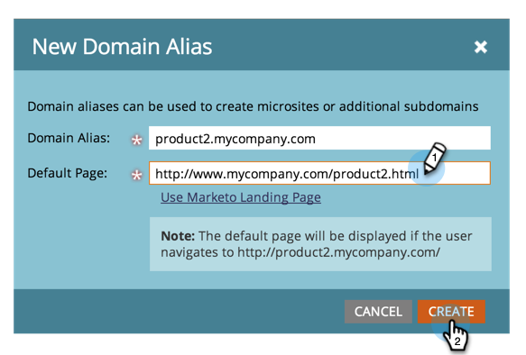

# Zusätzliche CNAMEs der Einstiegsseite hinzufügen {#add-additional-landing-page-cnames}

Möglicherweise möchten Sie Landingpage-CNAMEs hinzufügen, damit unterschiedliche URLs auf Ihre Marketo-Landingpages verweisen können. Die folgenden Schritte helfen Ihnen bei der Verwaltung mehrerer Domänen.

>[!CAUTION]
>
>Cookies können nicht domänenübergreifend verwendet werden.

>[!TIP]
>
>**Dieselbe Domäne auf oberster Ebene - Gut! Cookies werden freigegeben**.  **go**.mycompany.com > **info**.mycompany.com
>
>**Verschiedene Top-Level-Domänen - Schlecht! Cookies sind _nicht_ freigegeben**.  los.**mycompany**.com > go.**mynewcompany**.com

>[!NOTE]
>
>**Erforderliche Administratorberechtigungen**

1. Wechseln Sie zum Bereich **Admin** .

   

1. Klicken Sie auf **Mein Konto**.

   

1. Scrollen Sie nach unten zu &quot;Support-Informationen&quot;und kopieren Sie Ihre Munchkin-ID.

   

## Anfrage an IT senden {#send-request-to-it}

1. Bitten Sie Ihre IT-Abteilung, den folgenden CNAME einzurichten: (Ersetzen Sie das Wort [CNAME] durch den CNAME Ihrer Wahl und [Munchkin ID] durch den Text aus dem vorherigen Schritt).

   [CNAME].YourCompany.com > [Munchkin ID].mktoweb.com

## Neuen CNAME hinzufügen {#add-a-new-cname}

1. Nachdem Ihre IT-Abteilung den CNAME erstellt hat, wechseln Sie zum Bereich **Admin** .

   

1. Klicken Sie auf **Landingpages**.

   

1. Klicken Sie auf **Neu** und wählen Sie dann **Neuer Domänenname** aus.

   

1. Geben Sie Ihren **Domänennamen-Alias ein.** Die **Standardseite** wird angezeigt, wenn der Besucher keine URL eingibt. Geben Sie an, wohin der Benutzer in diesem Fall wechseln sollte.

   >[!NOTE]
   >
   >Für die Standardseite können Sie eine Landingpage oder eine externe URL auswählen, z. B. Ihre öffentliche Website.

   

1. Geben Sie Ihre **Standardseite** ein und klicken Sie auf **Erstellen**.

   

Gut! Jetzt wissen Sie, was zu tun ist, wenn Sie jemals einen CNAME hinzufügen möchten.
