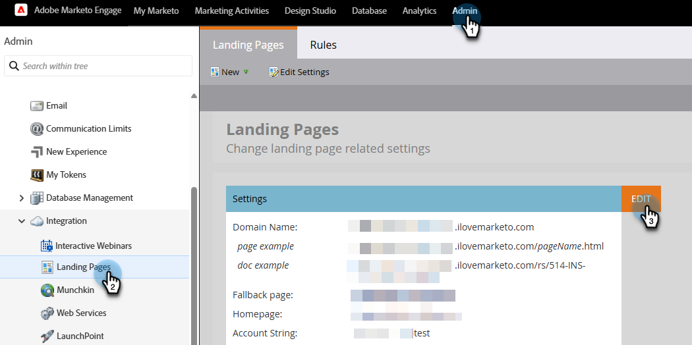

# Hinzufügen von SSL zu Ihren Landingpages {#add-ssl-to-your-landing-pages}

Mit der SSL-Verschlüsselung (Secure Socket Layer) können Sie alle Landingpages für eine Marketo Engage-Instanz sicher machen.

Wenn Sie ein Web-Formular ausfüllen oder eine Landingpage besuchen, die von Marketo Engage gehostet wird, werden die Informationen standardmäßig über ein nicht sicheres Protokoll (HTTP) gesendet. Gemäß der Richtlinie Ihres Unternehmens möchten Sie möglicherweise die an Marketo gesendeten Informationen über (HTTPS) sichern. Wenn Sie beispielsweise `http://info.mydomain.com/` besuchen, wird es jetzt `https://info.mydomain.com/`.

Marketo Engage verfolgt „Besuchte Web-Seite“ und „Link auf Web-Seite klicken“ standardmäßig über das nicht sichere HTTP-Protokoll. Wenn Sie möchten, dass Ihre Tracking-Links mit einem eigenen Zertifikat gesichert werden, müssen Sie Marketo einen separaten, nicht freigegebenen Server erstellen lassen, um ihn zu aktivieren. Um alle Aspekte der Interaktion eines Kontakts mit Ihnen zu sichern, müssen in der Regel sowohl Landingpages als auch Tracking-Links gesichert werden.

## SSL-Zertifizierung aktivieren {#enable-ssl-certification}

SSL automatisch für alle Domain-Aliase hinzufügen, die Sie im Rahmen der Landingpage-Regeln erstellen.

1. Navigieren Sie zum Bereich **Admin**.

   

1. Wählen Sie **Landingpages** aus der Baumstruktur aus. Klicken Sie auf **Registerkarte** Regeln **auf die Dropdown-Liste Neu** und wählen Sie **Neuer Domain-Alias**.

   

1. Geben Sie Ihren _Domain-_) und _Standardseite_ ein. Aktivieren Sie das **SSL-Zertifikat generieren**. Klicken Sie **Erstellen** wenn Sie fertig sind.

   

Dadurch wird automatisch ein SSL-Zertifikat für diese Domain hinzugefügt.

## SSL für Standard-Domain aktivieren {#enable-ssl-default-domain}

Gehen Sie wie folgt vor, um SSL für Ihre Standard-Domain zu aktivieren.

1. Wählen Sie noch im **Admin**-Bereich **Landingpages** aus. Klicken Sie auf die orangefarbene **Bearbeiten**-Schaltfläche neben _Einstellungen_.

   {width="800" zoomable="yes"}

   >[!NOTE]
   >
   >Bei Bedarf können Sie hier auch den Domain-Namen ändern (gültige Domain erforderlich).

1. Aktivieren Sie das Kontrollkästchen „SSL-Zertifikat generieren“ und klicken Sie auf Speichern.

   

>[!NOTE]
>
>* Die Spalte SSL-Zertifikat in der Liste zeigt den Zertifikatstatus für den gesamten Domain-Alias an, der nach der Veröffentlichung dieser Funktion erstellt wurde (25. April 2025). Wenn Sie SSL für eine Domain über den Marketo-Support aktiviert haben, ist das Zertifikat weiterhin vorhanden, wird aber nicht in der Tabelle angezeigt. Diese Tabelle enthält nur SSL-Zertifikate für Domains, die mithilfe der Schritte in diesem Artikel hinzugefügt wurden.
>
>* Es kann bis zu drei Minuten dauern, bis SSL BEREIT ist. Sie müssen die Seite aktualisieren, damit die Änderungen angezeigt werden.

## Fehlermeldungen {#error-messages}

Unten finden Sie Fehlermeldungen, die Sie möglicherweise zusammen mit ihren Definitionen erhalten.

<table><thead>
  <tr>
    <th>Fehler</th>
    <th>Details</th>
  </tr></thead>
<tbody>
  <tr>
    <td><i>Unerwarteter Fehler beim Erstellen einer Domain. Bitte wenden Sie sich an den Support, um Hilfe zu erhalten.</i></td>
    <td>Ein unerwarteter Fehler ist aufgetreten. Bitte sammeln Sie Protokolle und Fehlerdetails und eskalieren Sie das Problem an den Support.</td>
  </tr>
  <tr>
    <td><i>Die Standard-Domain wurde nicht gefunden. Bitte wenden Sie sich an den Support, um Hilfe zu erhalten.</i></td>
    <td>Beim Suchen der Standard-Domain ist ein Problem aufgetreten. Bitte wenden Sie sich an den Support, damit er weitere Informationen erhalten kann.</td>
  </tr>
  <tr>
    <td><i>SSL-Zertifikat wurde bereits ausgestellt.</i></td>
    <td>Für diese benutzerdefinierte Domain ist bereits ein SSL-Zertifikat vorhanden. Es sind keine weiteren Maßnahmen erforderlich, es sei denn, das Zertifikat ist abgelaufen oder muss erneut ausgestellt werden.</td>
  </tr>
  <tr>
    <td><i>Domain ist nicht der Standard-Domain zugeordnet.</i></td>
    <td>Die benutzerdefinierte Domain wird nicht korrekt der Standard-Domain zugeordnet. Überprüfen Sie die Einstellungen der Domain-Zuordnung und stellen Sie sicher, dass die DNS-Konfiguration auf die richtige Standard-Domain verweist.</td>
  </tr>
  <tr>
    <td><i>Domäne existiert bereits.</i></td>
    <td>Eine Domain mit demselben Namen ist bereits vorhanden.</td>
  </tr>
  <tr>
    <td><i>Vor dem Hinzufügen weiterer Domains ist eine einmalige IP-Konfiguration erforderlich. Bitte den Support kontaktieren, um die Einrichtung abzuschließen, und erneut versuchen, eine weitere Domain hinzuzufügen.</i></td>
    <td>Die erste benutzerdefinierte Domain nach der Standard-Domain benötigt eine einmalige Einrichtung, die von Ihnen eingeleitet wird. Bitte erstellen Sie ein Support-Ticket, um die Einrichtung abzuschließen und die Domain hinzuzufügen, nachdem sie abgeschlossen sind.</td>
  </tr>
</tbody></table>

## Zu beachtende Punkte {#things-to-note}

* **DNS-Zuordnung für Domain zu Marketo Engage**: Bevor Sie Domains in der Benutzeroberfläche hinzufügen, müssen Sie [CNAMEs einer von Marketo bereitgestellten Domain zuordnen](https://experienceleague.adobe.com/en/docs/marketo/using/getting-started/initial-setup/setup-steps#customize-your-landing-page-urls-with-a-cname){target="_blank"}.

* **Benutzerdefinierte SSLs**: Wenn Sie eine benutzerdefinierte SSL benötigen, senden Sie ein [Support-Ticket](https://nation.marketo.com/t5/support/ct-p/Support){target="_blank"}. Verwenden Sie nicht das Kontrollkästchen „Self-Service“ für die SSL-Erstellung.

* **Vorhandene SSLs**: Beim Hinzufügen einer Domain sucht das System nach bereits vorhandenen SSLs, die möglicherweise zuvor manuell erstellt wurden. Wenn diese Validierung auftritt, erstellen Sie Ihre Domain, ohne die SSL-Erstellung auszuwählen, und wir werden sie für Sie verbinden. [Support kontaktieren](https://nation.marketo.com/t5/support/ct-p/Support){target="_blank"} weitere Details/Optionen.

* **Domain für die Erstverfolgung**: Bei der erstmaligen Erstellung von Domains für E-Mail-Tracking-Links ist ein manuelles Eingreifen des [Marketo-Supports erforderlich](https://nation.marketo.com/t5/support/ct-p/Support){target="_blank"}. Die nachfolgende Erstellung einer Subdomain unter derselben Domain ist in der Benutzeroberfläche zulässig.

* **Hinzufügen von Zertifikaten zu vorhandenen Domains**: Das Hinzufügen von Zertifikaten zu vorhandenen Domains wird derzeit nicht unterstützt. Für bereits bestehende Domains oder für Fälle, in denen Sie das Kontrollkästchen „SSL-Zertifikat“ nicht aktiviert haben, müssen Sie sich an den [Marketo-Support](https://nation.marketo.com/t5/support/ct-p/Support){target="_blank"} wenden, um das Zertifikat hinzuzufügen.

* **Löschen von Domains**: Beim Löschen einer Domain wird das SSL-Zertifikat derzeit nicht automatisch gelöscht. Dies wird in einer zukünftigen Version behoben.
