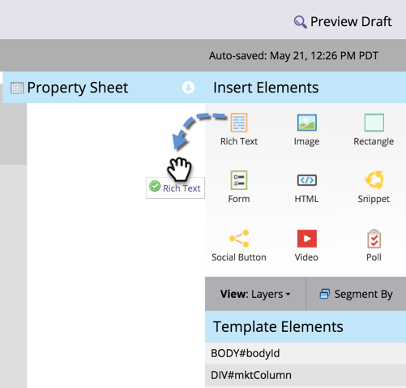

# Hinzufügen von Text und Token zu einer Landingpage {#add-text-and-tokens-to-a-landing-page}

>[!NOTE]
>
>Token werden nur in Marketo-Landingpages unterstützt.

## Hinzufügen von Rich-Text zu einer Landingpage {#add-rich-text-to-your-landing-page}

1. Wählen Sie Ihre Landingpage aus und klicken Sie auf **[!UICONTROL Entwurf bearbeiten]**.

   

   >[!NOTE]
   >
   >Der Landingpage-Designer wird in einem neuen Fenster geöffnet.

1. Ziehen Sie über das **[!UICONTROL Rich-Text]**-Element.

   

1. Geben Sie den gewünschten Text ein und klicken Sie auf **[!UICONTROL Speichern]**.

   

Nachdem Sie nun wissen, wie Sie Text zu einer Landingpage hinzufügen, arbeiten wir am Hinzufügen eines Tokens.

## Hinzufügen eines Tokens zu Ihrer Landingpage {#add-a-token-to-your-landing-page}

Token sind dynamische Textteile, mit denen Sie Ihre Landingpage personalisieren können.

>[!TIP]
>
>Dinge wie Vorname stammen aus dem Personendatensatz. Andere Token werden von der Registerkarte Meine Token im Programm bereitgestellt.

1. Wählen Sie Ihre Landingpage aus und klicken Sie auf **[!UICONTROL Entwurf bearbeiten]**.

   

   >[!NOTE]
   >
   >Der Landingpage-Designer wird in einem neuen Fenster geöffnet.

1. Doppelklicken Sie auf das Rich-Text-Feld, dem Sie das Token hinzufügen möchten.

   

1. Klicken Sie auf das Symbol Token einfügen .

   

1. Suchen Sie das Token Ihrer Wahl und wählen Sie es aus.

   

1. Geben Sie einen **[!UICONTROL Standardwert“ ein]** klicken Sie auf **[!UICONTROL Einfügen]**.

   

1. Klicken Sie auf **[!UICONTROL Speichern]**.

   

   Mission abgeschlossen! Sie haben jetzt ein Token auf Ihrer Landingpage.
