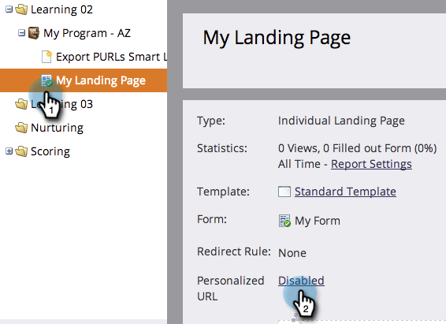

# Aktivieren personalisierter URLs für eine Landingpage {#enable-personalized-urls-for-a-landing-page}

Personalisierte URLs eignen sich gut für Print-E-Mail-Kampagnen.

>[!PREREQUISITES]
>
>[Personalisierte URLs für Ihr Konto aktivieren](/help/marketo/product-docs/demand-generation/landing-pages/personalizing-landing-pages/enable-personalized-urls-for-your-account.md)

1. Wählen Sie eine Landingpage aus und klicken Sie auf Einstellungen für **[!UICONTROL Personalisierte URL]**.

   

1. Jetzt können Sie **[!UICONTROL Personalisierte URL aktivieren]** und auf **[!UICONTROL Speichern]** klicken.

   

Sie haben personalisierte URLs für Ihre Landingpage aktiviert. Besucherinnen und Besucher, die diese URL verwenden, werden erkannt, und Token funktionieren ordnungsgemäß.
