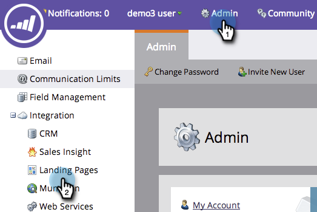

# Personalisierte URLs für Ihr Konto aktivieren {#enable-personalized-urls-for-your-account}

Personalisierte URLs eignen sich hervorragend für Druckpost-Kampagnen.

>[!NOTE]
>
>**Erforderliche Administratorberechtigungen**

1. Navigieren Sie zu **Admin** und klicken Sie auf **Landing Pages**.

   

1. Klicken **Bearbeiten**.

   

1. Überprüfen Sie die **Personalisierte URLs aktivieren** und klicken Sie auf **Speichern**.

   

Großartig gemacht! Nachdem Sie PURLs für Ihr Konto aktiviert haben, können Sie es für einzelne Landingpages aktivieren.

>[!NOTE]
>
>Wenn zwei Personen denselben Vor- und/oder Nachnamen haben, hängt das System automatisch eine Zahl an das Ende ihres PURL-Namens an.
>
>Beispiel:
>
>1. AnnaJones
>1. AnnaJones2
>1. AnnaJones3

