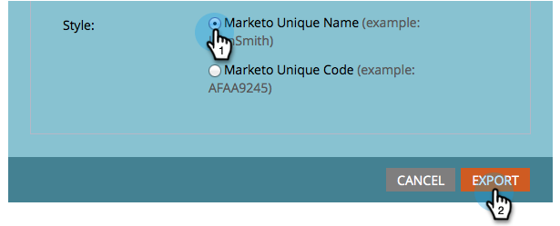

# Eine Liste mit personalisierten URLs exportieren {#export-a-list-with-personalized-urls}

>[!PREREQUISITES]
>
>* [Aktivieren Sie personalisierte URLs für Ihr Konto](/help/marketo/product-docs/demand-generation/landing-pages/personalizing-landing-pages/enable-personalized-urls-for-your-account.md)
>* [Aktivieren personalisierter URLs für eine Landingpage](/help/marketo/product-docs/demand-generation/landing-pages/personalizing-landing-pages/enable-personalized-urls-for-a-landing-page.md)

1. Wählen Sie Ihre Liste oder Smart-Liste aus, klicken Sie auf die Registerkarte **Leads** , um die Ergebnisse abzurufen, und klicken Sie dann auf das Excel-Symbol. INLINE Stellen Sie sicher, dass die Spalten **Marketo Unique Code** und **Marketo Unique Name** [sichtbar sind](/help/marketo/product-docs/core-marketo-concepts/smart-lists-and-static-lists/using-smart-lists/create-and-change-views-for-lists-and-smart-list.md).

   

1. Aktivieren Sie die Option **Personalisierte URL einschließen**, suchen Sie die Landingpage, für die Sie PURLs generieren möchten, und wählen Sie sie aus.

   

1. Wählen Sie die **URL** aus.

   

   >[!TIP]
   >
   >Wenn Sie mehrere URLs für dieselbe Landingpage sehen, liegt dies wahrscheinlich daran, dass Sie die Seiten-URL irgendwann in der Vergangenheit geändert und eine Umleitung erstellt haben.

1. Wählen Sie einen **Stil** und klicken Sie auf **Exportieren**.

   

1. Wenn der Export abgeschlossen ist, klicken Sie auf den Link **Jetzt herunterladen** , um die Datei zu speichern.

   

   Und du bist fertig! Sie haben jetzt eine Liste von Leads und personalisierten URLs.

   

   >[!NOTE]
   >
   >Wenn es Leads mit demselben Vor- und Nachnamen gibt, werden automatisch Zahlen angehängt, um sicherzustellen, dass die URLs eindeutig bleiben.
