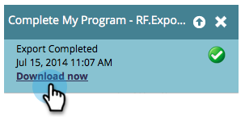
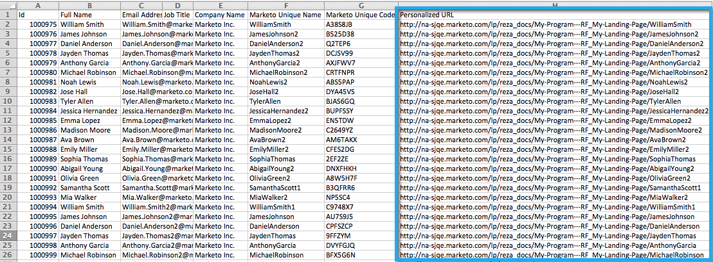

# Exportieren einer Liste mit personalisierten URLs {#export-a-list-with-personalized-urls}

>[!PREREQUISITES]
>
>* [Personalisierte URLs für Ihr Konto aktivieren](/help/marketo/product-docs/demand-generation/landing-pages/personalizing-landing-pages/enable-personalized-urls-for-your-account.md)
>* [Aktivieren personalisierter URLs für eine Landingpage](/help/marketo/product-docs/demand-generation/landing-pages/personalizing-landing-pages/enable-personalized-urls-for-a-landing-page.md)

1. Wählen Sie Ihre Liste oder Smart-Liste aus, klicken Sie auf die Registerkarte **[!UICONTROL Leads]**, um die Ergebnisse zu erhalten, und klicken Sie dann auf das Excel-Symbol. Stellen Sie sicher, dass **[!UICONTROL eindeutiger Marketo-Code]** und **[!UICONTROL eindeutige Marketo-]** Spalten[ sichtbar ](/help/marketo/product-docs/core-marketo-concepts/smart-lists-and-static-lists/using-smart-lists/create-and-change-views-for-lists-and-smart-list.md).

   

1. Markieren Sie **[!UICONTROL Personalisierte URL einschließen]**, suchen Sie die Landingpage, für die Sie PURLs generieren möchten, und wählen Sie sie aus.

   

1. Wählen Sie die **URL** aus.

   

   >[!TIP]
   >
   >Wenn für eine Landingpage mehrere URLs angezeigt werden, liegt das wahrscheinlich daran, dass Sie die URL der Seite zu einem früheren Zeitpunkt geändert und eine Umleitung erstellt haben.

1. Wählen Sie einen **[!UICONTROL Stil]** und klicken Sie auf **[!UICONTROL Exportieren]**.

   

1. Wenn der Export abgeschlossen ist, klicken Sie auf den Link **[!UICONTROL Jetzt herunterladen]**, um die Datei zu speichern.

   

   

   >[!NOTE]
   >
   >Wenn es Leads mit demselben Vor- und Nachnamen gibt, werden automatisch Nummern angehängt, um sicherzustellen, dass die URLs eindeutig bleiben.
