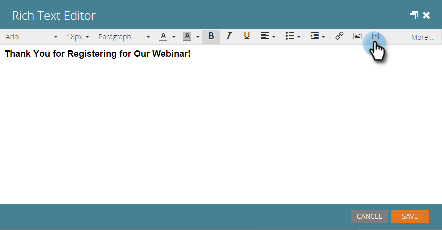

# Einbinden einer ICS-Datei für Kalenderereignisse in eine Landingpage {#include-a-calendar-event-ics-file-in-a-landing-page}

Mit **[!UICONTROL Token &quot;]**&quot; können Sie einen Kalenderereignis-Link (.ics) zu Ihren Marketo-Landingpages hinzufügen.

>[!PREREQUISITES]
>
>* [Erstellen einer Kalenderereignisdatei (.ics)](/help/marketo/product-docs/email-marketing/general/functions-in-the-editor/create-a-calendar-event-ics-file.md)

1. Klicken Sie im Landingpage-Editor auf **{...}** , um ein Token einzufügen.

   

1. Wählen Sie das Token **[!UICONTROL Kalenderdatei]** und klicken Sie auf **[!UICONTROL Einfügen]**.

   >[!CAUTION]
   >
   >Die folgenden Token werden auf Landingpages nicht unterstützt:
   >
   >* member.webinar URL

   

1. Klicken Sie auf **[!UICONTROL Speichern]**.

   Personen wird eine Landingpage angezeigt, die wie folgt aussieht:

   

Süß! Alles sollte jetzt gut funktionieren. Stellen Sie sicher, zu testen.

>[!MORELIKETHIS]
>
>[Kalenderereignis (.ics) in eine E-Mail einschließen](/help/marketo/product-docs/email-marketing/general/functions-in-the-editor/include-a-calendar-event-ics-in-an-email.md)
