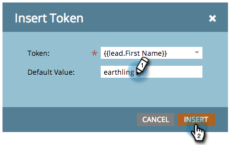

# Token – Überblick {#tokens-overview}

Ein Token ist eine Variable, die in Flussschritten intelligenter Kampagnen, E-Mails, Landingpages, Ausschnitten und Web-Kampagnen von Marketo verwendet werden kann.

## Grundlegendes zu Standardwerten {#understanding-default-values}

Wenn Sie ein Token verwenden, sollten Sie auch einen Standardwert angeben. Dies ist der Text, der anzeigt wird, wenn eine Person keinen Wert für das Feld hat, auf das Sie verweisen.

In diesem Beispiel lautet der Text der E-Mail „Hallo, (Vorname)“ oder „Hallo, Erdenbürgerin bzw. Erdenbürger“ (Standardwert).

>[!CAUTION]
>
>Token funktionieren im Preheader nicht, wenn Sie den E-Mail-Editor von Marketo verwenden. Wenn Sie ein Token im Preheader verwenden möchten, muss dies über Ihre eigene HTML in einer E-Mail-Vorlage erfolgen.

>[!NOTE]
>
>Diese Liste ist nicht vollständig. Token werden auch für jedes benutzerdefinierte Feld in Marketo erstellt.

## Personen-Token {#person-tokens}

* `{{lead.Acquisition Date}}`
* `{{lead.Acquisition Program Name}}`
* `{{lead.Acquisition Program}}`
* `{{lead.Address}}`
* `{{lead.Anonymous IP}}`
* `{{lead.Black Listed}}`
* `{{lead.City}}`
* `{{lead.Country}}`
* `{{lead.Created At}}`
* `{{lead.Date of Birth}}`
* `{{lead.Department}}`
* `{{lead.Do Not Call}}`
* `{{lead.Do Not Call Reason}}`
* `{{lead.Email Address}}`
* `{{lead.Email Invalid}}`
* `{{lead.Email Invalid Cause}}`
* `{{lead.Fax Number}}`
* `{{lead.First Name}}`
* `{{lead.Full Name}}`
* `{{lead.Id}}`
* `{{lead.Inferred City}}`
* `{{lead.Inferred Company}}`
* `{{lead.Inferred Country}}`
* `{{lead.Inferred Metropolitan Area}}`
* `{{lead.Inferred Phone Area Code}}`
* `{{lead.Inferred Postal Code}}`
* `{{lead.Inferred State Region}}`
* `{{lead.Is Customer}}`
* `{{lead.Is Employee}}`
* `{{lead.Is Partner}}`
* `{{lead.Job Title}}`
* `{{lead.Last Name}}`
* `{{lead.Lead Source}}`
* `{{lead.Marketing Suspended}}`
* `{{lead.Middle Name}}`
* `{{lead.Mobile Phone Number}}`
* `{{lead.Original Referrer}}`
* `{{lead.Original Search Engine}}`
* `{{lead.Original Search Phrase}}`
* `{{lead.Original Source Info}}`
* `{{lead.Original Source Type}}`
* `{{lead.Person Notes}}`
* `{{lead.Phone Number}}`
* `{{lead.Registration Source Info}}`
* `{{lead.Registration Source Type}}`
* `{{lead.Salutation}}`
* `{{lead.SFDC Created Date}}`
* `{{lead.SFDC Is Deleted}}`
* `{{lead.SFDC Type}}`
* `{{lead.Unsubscribed}}`
* `{{lead.Unsubscribed Reason}}`
* `{{lead.Updated At}}`
* Benutzerdefinierte Personenfelder funktionieren auch, wenn Sie ihren Anzeigenamen verwenden, z. B. `{{lead.Custom Field Name}}`

## Unternehmens-Token {#company-tokens}

* `{{Company.Account Owner Email Address}}`
* `{{Company.Address}}`
* `{{Company.Annual Revenue}}`
* `{{Company.City}}`
* `{{Company.Company Name}}`
* `{{Company.Company Notes}}`
* `{{Company.Country}}`
* `{{Company.Industry}}`
* `{{Company.Main Phone}}`
* `{{Company.Num Employees}}`
* `{{Company.Parent Company Name}}`
* `{{Company.Postal Code}}`
* `{{Company.SFDC Account Num}}`
* `{{Company.SFDC Created Date}}`
* `{{Company.SFDC Type}}`
* `{{Company.SIC Code}}`
* `{{Company.Site}}`
* `{{Company.State}}`
* `{{Company.Website}}`
* Benutzerdefinierte Unternehmensfelder funktionieren auch, wenn Sie ihren Anzeigenamen verwenden, z. B. `{{Company.Custom Field Name}}`

## Kampagnen-Token {#campaign-tokens}

* `{{campaign.name}}`
* `{{campaign.id}}`
* `{{campaign.description}}`

## System-Token {#system-tokens}

>[!NOTE]
>
>Weitere Informationen zu diesen Token finden Sie im [System-Token-Glossar](/help/marketo/product-docs/email-marketing/general/using-tokens/system-tokens-glossary.md).

* `{{system.date}}`
* `{{system.time}}`
* `{{system.dateTime}}`
* `{{system.forwardToFriendLink}}`
* `{{system.unsubscribeLink}}`
* `{{system.viewAsWebpageLink}}`

## Trigger-Token {#trigger-tokens}

* `{{trigger.Trigger Name}}`
* `{{trigger.Name}}`
* `{{trigger.Link}}`
* `{{trigger.Subject}}`
* `{{trigger.Category}}`
* `{{trigger.Details}}`
* `{{trigger.Web Page}}`
* `{{trigger.Client IP Address}}`
* `{{trigger.Sent By}}`
* `{{trigger.Received By}}`
* `{{trigger.Referrer}}`
* `{{trigger.Search Engine}}`
* `{{trigger.Search Query}}`

>[!NOTE]
>
>Erfahren Sie mehr über [Token für interessante Momente](/help/marketo/product-docs/marketo-sales-insight/msi-for-salesforce/features/tabs-in-the-msi-panel/interesting-moments/trigger-tokens-for-interesting-moments.md), die auf in einer intelligenten Kampagne verwendeten Triggern basieren.

## Programm-Token {#program-tokens}

* `{{program.Name}}`
* `{{program.Description}}`
* `{{program.id}}`

## [!UICONTROL Meine Token] {#my-tokens}

[!UICONTROL Meine Token] werden in einem Programm definiert und beginnen mit `{{my.` gefolgt vom Namen, den Sie für das Token erstellt haben. Erfahren Sie mehr über [Meine Token in einem Programm](/help/marketo/product-docs/core-marketo-concepts/programs/tokens/understanding-my-tokens-in-a-program.md).

## Mitglieder-Token {#member-token}

Mitglieder-Token werden verwendet, um eindeutige Werte von integrierten Dienstpartnern einzufügen. Mitglieder-Token werden häufig für eindeutige URLs für Webinar-Teilnehmende verwendet. Jeder Person wird eine eindeutige URL für den Zugriff auf das Webinar zugeteilt, die mithilfe eines `{{member.webinar url}}`-Tokens eingefügt werden kann. Das `{{member.webinar url}}`-Token löst die eindeutige, vom Dienstleister generierte Bestätigungs-URL der Person automatisch auf.

* `{{member.webinar url}}`

>[!CAUTION]
>
>Das `{{member.webinar url}}`-Token wird nur aufgefüllt, wenn die intelligente Kampagne, die die E-Mail sendet, ein untergeordnetes Asset des Veranstaltungsprogramms ist.
