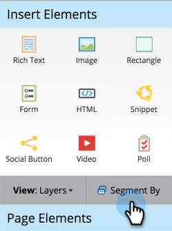

# Dynamische Inhalte in einer Landingpage verwenden {#use-dynamic-content-in-a-landing-page}

>[!PREREQUISITES]
>
>* [Erstellen einer Segmentierung](/help/marketo/product-docs/personalization/segmentation-and-snippets/segmentation/create-a-segmentation.md)
>* [Erstellen einer Freiform-Landingpage](/help/marketo/product-docs/demand-generation/landing-pages/free-form-landing-pages/create-a-free-form-landing-page.md)
>* [Hinzufügen eines neuen Formulars zu einer Freiform-Einstiegsseite](/help/marketo/product-docs/demand-generation/landing-pages/free-form-landing-pages/add-a-new-form-to-a-free-form-landing-page.md)

Die Verwendung von dynamischen Inhalten in Landingpages bindet Personen mit zielgerichteten Informationen an.

## Segmentierung hinzufügen {#add-segmentation}

1. Wechseln Sie zu **Marketingaktivitäten**.

   

   Klicken Sie auf Ihre Landingpage und dann auf Entwurf bearbeiten.

   

   Klicken Sie auf Segment nach.

   

   Geben Sie den Segmentierungsnamen ein und klicken Sie auf Speichern.

   

   Ihre Segmentierung und ihre Segmente werden rechts unter Dynamisch angezeigt.

   

   >[!NOTE]
   >
   >Alle Landingpage-Elemente sind standardmäßig statisch.

## Element dynamisch machen {#make-element-dynamic}

1. Ziehen Sie Elemente aus &quot;Statisch&quot;in &quot;**Dynamisch**&quot;.

   

1. Sie können Elemente auch über das Element **Einstellungen** als statisch oder dynamisch festlegen.

   

## Dynamische Inhalte anwenden {#apply-dynamic-content}

1. Wählen Sie ein Element unter einem Segment aus und klicken Sie dann auf **Bearbeiten**. Wiederholen Sie diesen Vorgang für jedes Segment.

   

1. Ein grünes Häkchen zeigt segmentspezifischen Inhalt an. Ein leeres Feld zeigt den Standardinhalt des Segments an.

   

   >[!CAUTION]
   >
   >Änderungen am Standard-Inhaltsbaustein für Segmente werden auf alle Segmente angewendet.

   >[!TIP]
   >
   >Erstellen Sie eine Standard-Landingpage, bevor Sie den Inhalt für die verschiedenen Segmente ändern.

Voila! Jetzt können Sie zielgerichtete Inhalte versenden.

>[!MORELIKETHIS]
>
>* [Anzeigen einer Vorschau einer Landingpage mit dynamischem Inhalt](/help/marketo/product-docs/demand-generation/landing-pages/landing-page-actions/preview-a-landing-page-with-dynamic-content.md)
>* [Verwenden dynamischer Inhalte in einer E-Mail](/help/marketo/product-docs/email-marketing/general/functions-in-the-editor/using-dynamic-content-in-an-email.md)
