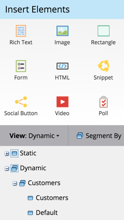

# Dynamische Inhalte in einer Landingpage verwenden {#use-dynamic-content-in-a-landing-page}

>[!NOTE]
>
>**Voraussetzungen**
>
>* [Eine Segmentierung erstellen](../../../../product-docs/personalization/segmentation-and-snippets/segmentation/create-a-segmentation.md)
>* [Erstellen einer Freiform-Landingpage](../../../../product-docs/demand-generation/landing-pages/free-form-landing-pages/create-a-free-form-landing-page.md)
>* [hinzufügen eines neuen Formulars in eine Freiform-Landingpage](../../../../product-docs/demand-generation/landing-pages/free-form-landing-pages/add-a-new-form-to-a-free-form-landing-page.md)

>

Die Verwendung von dynamischen Inhalten in Landingpages bindet Menschen mit gezielten Informationen.

## hinzufügen {#add-segmentation}

1. Gehen Sie zu **Marketing-Aktivitäten**.

   

   Klicken Sie auf Ihre Landingpage und dann auf Entwurf bearbeiten.

   

   Klicken Sie auf Segment nach.

   

   Geben Sie den Segmentierungsnamen ein und klicken Sie auf Speichern.

   

   Ihre Segmentierung und ihre Segmente werden rechts unter &quot;Dynamisch&quot;angezeigt.

   

   >[!NOTE]
   >
   >Alle Elemente der Landingpage sind standardmäßig statisch.

## Element dynamisch machen {#make-element-dynamic}

1. Ziehen Sie Elemente per Drag &amp; Drop von &quot;Statisch&quot;in &quot; **Dynamisch**&quot;.

   

1. Sie können Elemente auch über die Elementeinstellungen als &quot;Statisch&quot;oder &quot;Dynamisch&quot; **einstellen**.

   

## Dynamische Inhalte anwenden {#apply-dynamic-content}

1. Wählen Sie ein Element unter einem Segment aus und klicken Sie dann auf **Bearbeiten**. Wiederholen Sie diese Schritte für jedes Segment.

   

1. Ein grünes Häkchen zeigt segmentspezifischen Inhalt an. Ein leeres Feld zeigt den Standardsegmentinhalt an.

   

   >[!CAUTION]
   >
   >Änderungen am Standard-Segmentinhaltsblock werden auf alle Segmente angewendet.

   >[!TIP]
   >
   >Erstellen Sie eine Standard-Landingpage, bevor Sie den Inhalt für die verschiedenen Segmente ändern.

Voila! Sie können jetzt zielgerichtete Inhalte senden.

>[!NOTE]
>
>**Verwandte Artikel**
>
>* [Vorschau einer Landingpage mit dynamischen Inhalten](../../../../product-docs/demand-generation/landing-pages/landing-page-actions/preview-a-landing-page-with-dynamic-content.md)
>* [Dynamische Inhalte in einer E-Mail verwenden](../../../../product-docs/email-marketing/general/functions-in-the-editor/using-dynamic-content-in-an-email.md)

>

