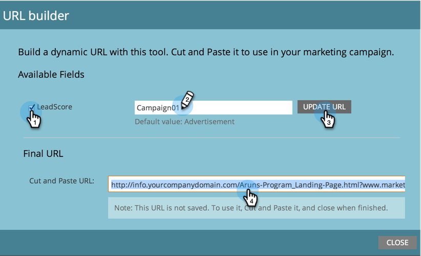

# Verwenden des URL-Builders {#using-the-url-builder}

Der URL Builder hilft Ihnen beim Erstellen von URLs, die in ausgeblendete Formularfelder von Marketo eingefügt werden können.

>[!PREREQUISITES]
>
>Erfahren Sie, wie Sie in Formularen ausgeblendete Felder erstellen und ihre Einstellungen in [Formularfeld als ausgeblendet festlegen](/help/marketo/product-docs/demand-generation/forms/form-fields/set-a-form-field-as-hidden.md) bearbeiten.

1. Wählen Sie eine Landingpage aus, klicken Sie auf **[!UICONTROL Landingpage-Aktionen]** bewegen Sie den Mauszeiger über **[!UICONTROL URL-Tools]** und klicken Sie dann auf **[!UICONTROL URL-Builder]**.

   

1. Wählen Sie die gewünschten Felder aus, geben Sie den Wert ein und klicken Sie auf **[!UICONTROL URL aktualisieren]**.

   

   >[!NOTE]
   >
   >Wenn im Builder keine Felder verfügbar sind, stellen Sie sicher, dass das Formular ausgeblendete Felder enthält und dass diese [auf „URL-Parameter akzeptieren“ eingestellt &#x200B;](/help/marketo/product-docs/demand-generation/forms/form-fields/set-a-hidden-form-field-value.md#url-parameter).

Tolle Arbeit! Sie können jetzt die URL kopieren, einfügen und im Web verwenden.
