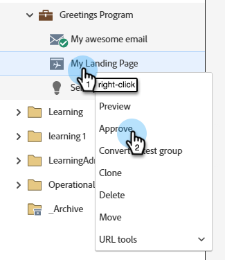
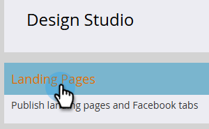
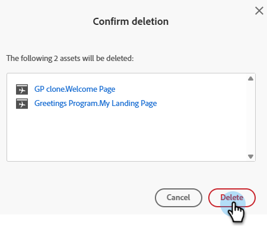

# Genehmigen, Aufheben der Genehmigung oder Löschen einer Landingpage {#approve-unapprove-or-delete-a-landing-page}

Landingpages befinden sich im Entwurfsmodus, bis Sie sie genehmigen. Bei der Validierung werden die Seiten im Rest des Systems verfügbar gemacht. Wenn Sie eine genehmigte Landingpage bearbeiten, speichert Marketo Engage den Entwurf, verwendet jedoch die genehmigte Version, bis Sie den Entwurf genehmigen.

## Genehmigen einer Landingpage {#approve-a-landing-page}

1. Wählen Sie die gewünschte Landingpage aus, klicken Sie auf und klicken Sie auf **[!UICONTROL Entwurf genehmigen]**.

   

   >[!TIP]
   >
   >Sie haben die Möglichkeit, [mehrere Seiten gleichzeitig zu genehmigen](/help/marketo/product-docs/demand-generation/landing-pages/landing-page-actions/approve-multiple-landing-pages-at-once.md) falls gewünscht.

Sie können auch im linken Navigationsbereich mit der rechten Maustaste auf Ihre Landingpage klicken und &quot;**[!UICONTROL &quot;]**.

>[!NOTE]
>
>Einer genehmigten Landingpage wurde ein grünes Häkchen hinzugefügt.

## Genehmigung für eine Landingpage aufheben {#unapprove-a-landing-page}

1. Wählen Sie die gewünschte Landingpage aus und klicken Sie auf **[!UICONTROL Genehmigung aufheben]**.

   

Sie können auch im linken Navigationsbereich mit der rechten Maustaste auf Ihre Landingpage klicken und „Genehmigung **[!UICONTROL &quot;]**.

>[!NOTE]
>
>Ihre nicht genehmigte Landingpage wird nicht mehr im Web veröffentlicht und erzeugt keine zusätzliche Aktivität. Besucherinnen und Besucher von nicht genehmigten Landingpages und deren Facebook-Registerkarten sehen die [Fallback-Seite](/help/marketo/product-docs/administration/settings/set-a-fallback-page.md).

## Löschen einer Landingpage {#delete-a-landing-page}

1. Wählen Sie die gewünschte Landingpage aus. Klicken Sie auf die **[!UICONTROL Landingpage-Aktionen]** und wählen Sie **[!UICONTROL Löschen]**.

   

   >[!IMPORTANT]
   >
   >Eine genehmigte Landingpage kann nicht gelöscht werden. Genehmigung muss zunächst aufgehoben werden.

Sie können auch im linken Navigationsbereich mit der rechten Maustaste auf Ihre Landingpage klicken und &quot;**[!UICONTROL &quot;]**.

## Löschen mehrerer Landingpages {#delete-multiple-landing-pages}

1. Klicken Sie im [!UICONTROL &#x200B; „Design &#x200B;]&quot; auf **[!UICONTROL Landingpages]**.

   

1. Wählen Sie die gewünschten Landingpages aus. Klicken Sie auf die **[!UICONTROL Landingpage-Aktionen]** und wählen Sie **[!UICONTROL Löschen]**.

   

1. Klicken Sie **[!UICONTROL Löschen]** zur Bestätigung.

   
