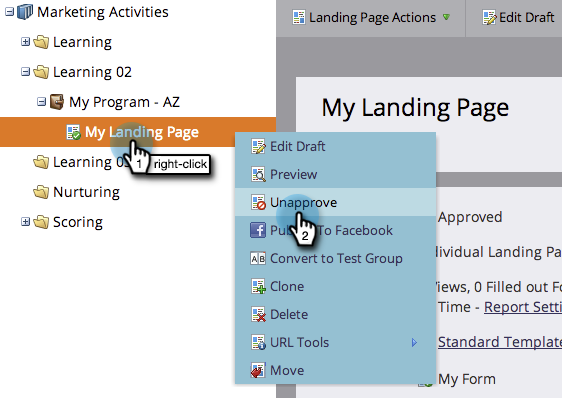

# Genehmigen, Aufheben der Genehmigung oder Löschen einer Landingpage {#approve-unapprove-or-delete-a-landing-page}

Landingpages befinden sich im Entwurfsmodus, bis Sie sie genehmigen. Bei der Validierung werden die Seiten im Rest des Systems verfügbar gemacht. Wenn Sie eine genehmigte Landingpage bearbeiten, speichert Marketo den Entwurf, verwendet jedoch die genehmigte Version, bis Sie den Entwurf genehmigen.

## Genehmigen einer Landingpage {#approve-a-landing-page}

1. Wählen Sie eine Landingpage aus, gehen Sie zu **[!UICONTROL Landingpage-Aktionen]** und klicken Sie auf **[!UICONTROL Genehmigen]**.

   >[!TIP]
   >
   >Sie können [mehrere Seiten gleichzeitig genehmigen](/help/marketo/product-docs/demand-generation/landing-pages/landing-page-actions/approve-multiple-landing-pages-at-once.md) um Ihr Leben zu vereinfachen.

   

1. Sie können auch mit der rechten Maustaste auf Ihre Landingpage klicken und dann auf **[!UICONTROL Genehmigen]** klicken.

   

   >[!NOTE]
   >
   >Nach der Genehmigung ist das Landingpage-Symbol mit einem grünen Häkchen versehen.

## Genehmigung für eine Landingpage aufheben {#unapprove-a-landing-page}

1. Wählen Sie eine Landingpage aus, gehen Sie zu **[!UICONTROL Landingpage-Aktionen]** und klicken Sie auf **[!UICONTROL Genehmigung aufheben]**.

   

1. Sie können auch mit der rechten Maustaste auf Ihre Landingpage klicken und dann auf **[!UICONTROL Genehmigung aufheben]**.

   

>[!NOTE]
>
>Ihre nicht genehmigte Landingpage wird nicht mehr im Web veröffentlicht und erzeugt keine zusätzliche Aktivität. Besucherinnen und Besucher nicht genehmigter Landingpages und ihrer Facebook-Registerkarten sehen die [Fallback-Seite](/help/marketo/product-docs/administration/settings/set-a-fallback-page.md).

## Löschen einer Landingpage {#delete-a-landing-page}

1. Wählen Sie eine Landingpage aus, gehen Sie zu **[!UICONTROL Landingpage-Aktionen]** und klicken Sie auf **[!UICONTROL Löschen]**.

   

   >[!NOTE]
   >
   >Sie können eine genehmigte Landing Page nicht löschen. Entziehen Sie zuerst die Genehmigung.

1. Sie können auch mit der rechten Maustaste auf Ihre Landingpage klicken und dann auf **[!UICONTROL Löschen]** klicken.

   

## Löschen mehrerer Landingpages {#delete-multiple-landing-pages}

Möchten Sie mehr als eine Landingpage gleichzeitig löschen? So geht&#39;s.

1. Klicken [!UICONTROL  in ]Design Studio **[!UICONTROL auf „Landingpages]**.

   

1. Klicken Sie auf die erste zu löschende Landingpage und dann bei gedrückter Umschalttaste auf die letzte.

   

   >[!TIP]
   >
   >Sie können auch Strg+Klicken verwenden, um mehrere Landingpages zu löschen, die nicht sequenziell sind.

1. Klicken Sie auf die **[!UICONTROL Landingpage-Aktionen]** und wählen Sie **[!UICONTROL Löschen]**.

   

1. Klicken Sie auf **[!UICONTROL Löschen]**.

   

Fantastisch! Jetzt wissen Sie, wie Sie Landingpages genehmigen, genehmigen und löschen können.
