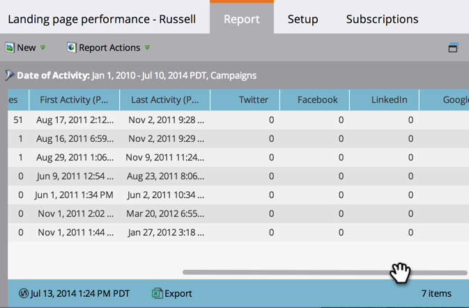

# Bericht zur Leistung der Landingpage {#landing-page-performance-report}

Ermitteln Sie, wie viele Personen die Formulare auf Ihren Landingpages ausgefüllt haben und wie viele davon neu waren.

>[!NOTE]
>
>Wenn Sie eine Diskrepanz in den Zahlen zwischen Ihrer Smart-Liste und dem Leistungsbericht für die Landingpage sehen, liegt das wahrscheinlich daran, dass Smart-Listen nur Daten zu Personen filtern, während Leistungsberichte für Landingpages neben den Personendaten auch Social-Media-Aktivitäten (Facebook, Google-Anzeigen usw.) und anonyme Aktivitäten enthalten.

1. [Bericht erstellen](/help/marketo/product-docs/reporting/basic-reporting/creating-reports/create-a-report-in-a-program.md) und Landingpage-Leistung auswählen [Berichtstyp](/help/marketo/product-docs/reporting/basic-reporting/report-types/report-type-overview.md).
1. [Legen Sie den Zeitrahmen Ihres Berichts fest](/help/marketo/product-docs/reporting/basic-reporting/editing-reports/change-a-report-time-frame.md) und klicken Sie auf die Registerkarte Bericht .
1. Das ist alles! Erkunden Sie Ihren Bericht, um zu beurteilen, wie gut Ihre Landingpages funktionieren.

   

   Unter den Spalten in einem Landingpage-Leistungsbericht spiegeln Konversionen und Konversion % die Anzahl der Ausfüllungen eines Formulars wider.

   >[!TIP]
   >
   >Finden Sie die Seiten mit dem höchsten Konversionsprozentsatz! [Bericht sortieren](/help/marketo/product-docs/reporting/basic-reporting/editing-reports/sort-report-on-columns.md) in dieser Spalte und wählen Sie Absteigend sortieren.

   Das AB-Symbol im Bericht zeigt an, dass die Statistiken die Summe aller Seiten in dieser [Landingpage-Testgruppe“ ](/help/marketo/product-docs/demand-generation/landing-pages/understanding-landing-pages/landing-page-test-groups.md).

1. Scrollen Sie nach rechts, um die Anzahl der Besuche anzuzeigen, die von verschiedenen Social-Media-Plattformen stammen.

   

>[!NOTE]
>
>Von der Schaltfläche [Social“ mit Analytics generierte Aktivitäten ](/help/marketo/product-docs/demand-generation/landing-pages/free-form-landing-pages/add-a-social-button-to-a-free-form-landing-page.md) hier nicht enthalten. Diese Statistiken finden Sie unter [Social-Dashboard](/help/marketo/product-docs/demand-generation/social/social-functions/view-social-performance.md).

>[!MORELIKETHIS]
>
>[Filtern Sie Ihren Landingpage-Leistungsbericht](/help/marketo/product-docs/demand-generation/landing-pages/landing-page-actions/filter-a-landing-page-performance-report.md) nach lokalen oder globalen Assets.
