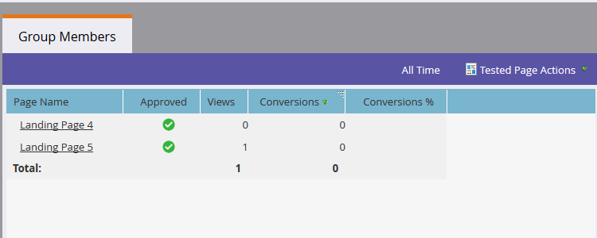

# Startseite Testgruppen {#landing-page-test-groups}

Marketo verfolgt die Anzahl der Seitenansichten und Formularabschlüsse auf jeder getesteten Seite innerhalb einer Testgruppe. Mithilfe von Testgruppenergebnissen können Sie festlegen, welche Einstiegsseite am überzeugendsten ist. So erstellen Sie eine Testgruppe:

>[!PREREQUISITES]
>
>[Erstellen Sie zwei oder mehr Landingpages](/help/marketo/getting-started/quick-wins/landing-page-with-a-form.md), vorzugsweise mit einem Formular.

1. Klicken Sie in Design Studio auf **Neu**. Wählen Sie im Dropdown-Menü **Neue Testgruppe** aus.

   

   >[!NOTE]
   >
   >Die anderen Möglichkeiten zum Erstellen einer Testgruppe sind:
   >
   >* Klicken Sie mit der rechten Maustaste auf eine Landingpage im Baum und wählen Sie **In Testgruppe konvertieren** aus.
   >* Erstellen Sie eine Einstiegsseitentestgruppe in einem Programm, indem Sie im Menü **Neues lokales Asset** die Option **AB-Testgruppe** auswählen.

1. Geben Sie einen Namen und eine optionale Beschreibung ein. Wählen Sie die Einstiegsseiten aus, die Sie testen möchten, und klicken Sie auf **Erstellen**.

   

   >[!NOTE]
   >
   >Es stehen nur nicht genehmigte Einstiegsseiten zur Auswahl.

1. Klicken Sie mit der rechten Maustaste auf jede Landingpage und wählen Sie **Genehmigen** aus.

   

1. Klicken Sie auf das Dropdown-Menü **Gruppenoptionen testen** und wählen Sie **Testgruppe genehmigen** aus.

   

   Das ist es! Sie können jetzt die Statistiken Ihrer ausgewählten Einstiegsseiten vergleichen.

   

   >[!TIP]
   >
   >Wenn Sie die Testgruppe jemals löschen möchten, klicken Sie einfach auf **Gruppenaktionen testen** und wählen Sie **Testgruppe löschen** aus.
