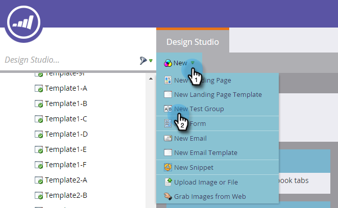

# Landingpage-Testgruppen {#landing-page-test-groups}

Marketo verfolgt die Anzahl der Seitenansichten und Formularausfüllungen auf jeder getesteten Seite innerhalb einer Testgruppe. Sie können die Ergebnisse von Testgruppen verwenden, um zu entscheiden, welche Landingpage am überzeugendsten ist. So erstellen Sie eine Testgruppe.

>[!PREREQUISITES]
>
>[Erstellen Sie zwei oder mehr Landingpages](/help/marketo/getting-started/quick-wins/landing-page-with-a-form.md) vorzugsweise mit einem Formular.

1. Klicken Sie im Design Studio auf **[!UICONTROL Neu]**. Wählen Sie in der Dropdown-Liste **[!UICONTROL Neue Testgruppe]** aus.

   

   >[!NOTE]
   >
   >Die anderen Möglichkeiten zum Erstellen einer Testgruppe sind:
   >
   >* Klicken Sie mit der rechten Maustaste auf eine Landingpage in der Baumstruktur und wählen Sie **[!UICONTROL In Testgruppe konvertieren]**
   >* Erstellen Sie eine Landingpage-Testgruppe in einem Programm, indem Sie **[!UICONTROL AB-Testgruppe]** im Menü **[!UICONTROL Neues lokales Asset]** auswählen

1. Geben Sie einen Namen und eine optionale Beschreibung ein. Wählen Sie die zu testenden Landingpages aus und klicken Sie auf **[!UICONTROL Erstellen]**.

   

   >[!NOTE]
   >
   >Es stehen nur nicht genehmigte Landingpages zur Auswahl.

1. Klicken Sie mit der rechten Maustaste auf jede Landingpage und wählen Sie **[!UICONTROL Genehmigen]**.

   

1. Klicken Sie auf **[!UICONTROL Testgruppenaktionen]** und wählen Sie **[!UICONTROL Testgruppe genehmigen]** aus.

   

   Jetzt können Sie die Statistiken der ausgewählten Landingpages vergleichen.

   

   >[!TIP]
   >
   >Wenn Sie die Testgruppe löschen möchten, klicken Sie auf **[!UICONTROL Testgruppenaktionen]** und wählen Sie **[!UICONTROL Testgruppe löschen]**.
