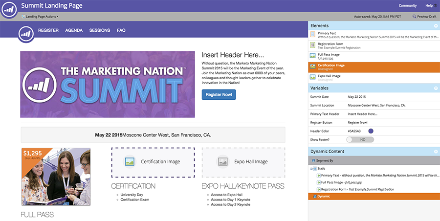

# Grundlegendes zu Freiform-Landingpages im Vergleich zu geführten Landingpages {#understanding-free-form-vs-guided-landing-pages}

Die ausgewählte Vorlage bestimmt, in welchem Landingpage-Bearbeitungsmodus Sie arbeiten. Es gibt zwei mögliche Pfade[&#x200B; (Freiform](/help/marketo/product-docs/demand-generation/landing-pages/free-form-landing-pages/create-a-free-form-landing-page.md) und [Geführt](/help/marketo/product-docs/demand-generation/landing-pages/guided-landing-pages/create-a-guided-landing-page.md). Nachfolgend finden Sie eine kurze Zusammenfassung der wichtigsten Unterschiede.

## Freiformseiten {#free-form-pages}

* Ziehen Sie beliebige Inhalte per Drag-and-Drop dorthin, wo Sie sie platzieren möchten.
* Die Vorlage ist wie ein [!DNL SlideMaster] in [!DNL PowerPoint], nur ein Hintergrund.
* Erstellen Sie mit einem Klick eine einfache mobile Version Ihrer Seite.
* Am besten geeignet, wenn Sie nicht viel Zeit oder technische Ressourcen zur Verfügung haben.

## Geführte Seiten {#guided-pages}

* Vordefiniertes Layout/vordefinierte Struktur basierend auf der Vorlage.
* Nur Regionen oder Variablen, die in der Vorlage als bearbeitbar definiert sind, können im Editor angepasst werden.
* Code-Änderungen zum Ändern des Layouts und Hinzufügen zusätzlicher Assets erforderlich.
* Look-and-Feel über Geräte hinweg, bestimmt durch in die Vorlage integrierte Regeln.
* Am besten geeignet, wenn Sie responsive Vorlagen codiert oder erworben haben oder eine vordefinierte Marketo-Vorlage ändern möchten.

