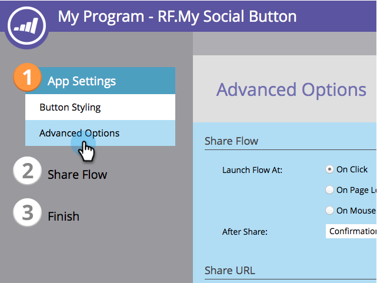

# Konfigurieren von Eingabeaufforderungen nach der Freigabe {#configure-after-share-prompts}

In Social-Schaltflächen-, Video- und Umfrage-Apps können Sie wählen, was passiert, wenn eine Person Ihre Inhalte in ihrem sozialen Netzwerk teilt.

>[!IMPORTANT]
>
>Am 31. Juli 2024 begannen wir mit der Einstellung dieser Funktion. Neue Assets können nicht mehr erstellt werden. Vorhandene Assets werden bis zum 31. Januar 2025 weiterhin funktionieren. [Weitere Informationen](https://nation.marketo.com/t5/employee-blogs/marketo-engage-social-features-deprecation/ba-p/351977){target="_blank"}

1. Wechseln Sie zu **Marketingaktivitäten**.

   

1. Wählen Sie die App aus und klicken Sie auf **Entwurf bearbeiten**.

   

1. Wechseln Sie im Social-App-Editor zu **App-Einstellungen** und dann zu **Erweiterte Optionen**.

   

1. Wählen Sie für **Nach Freigabe** das gewünschte Verhalten aus.

   

   * **Bestätigungsnachricht:** Zeigen Sie nach der Freigabe der Person eine Bestätigung an.
   * **E-Mail-Erfassung:** Nachdem die Person freigegeben hat, fordern Sie ihre E-Mail-Adresse an.

   >[!NOTE]
   >
   >Wenn Sie **E-Mail-Erfassung** auswählen, wird die Anfrage nur angezeigt, wenn die Person ihre Informationen noch nicht bereitgestellt hat.

1. Wenn Sie **Bestätigungsnachricht:** auswählen, gehen Sie zu **Fluss freigeben** und dann zu **Bestätigungsnachricht**.

   

1. Bearbeiten Sie die Bestätigungsnachricht.

   

1. Wenn Sie &quot;**E-Mail-Erfassung**&quot;(anstelle der Bestätigung) auswählen: Wechseln Sie zu &quot;**Fluss freigeben**&quot;und dann zu &quot;**E-Mail-Erfassung**&quot;.

   

1. Wählen Sie aus, ob eine Marketing-Eingabeaufforderung eingefügt werden soll und ob dieses Kontrollkästchen standardmäßig aktiviert ist (**Opt-out**) oder nicht (**Opt-in**).

   

1. Bearbeiten Sie die E-Mail-Adresse und die Marketingaufforderung (falls vorhanden).

   
