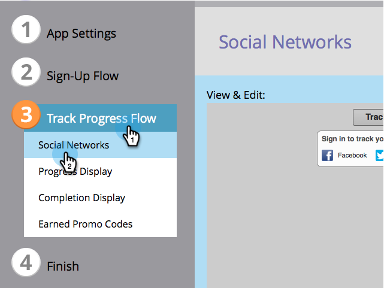

# Konfigurieren des Fortschrittsablaufs für ein Verweisangebot {#configure-track-progress-flow-for-a-referral-offer}

Wenn Sie [Erstellen eines Verweisangebots](/help/marketo/product-docs/demand-generation/social/referral-offers/create-a-referral-offer.md)können Sie die Aufforderungen konfigurieren, die den Teilnehmern ihren Fortschritt in Richtung Belohnung zeigen.

1. Navigieren Sie zu **Marketingaktivitäten**.

   

1. Wählen Sie das Angebot aus und klicken Sie auf **Entwurf bearbeiten**.

   

1. Navigieren Sie im Angebotseditor zu **Verfolgen des Fortschrittsflusses** > **Soziale Netzwerke**.

   

1. Im **Anzeigen und Bearbeiten** bearbeiten Sie die Aufforderung, die Teilnehmer daran zu erinnern, sich bei demselben sozialen Netzwerk anzumelden, mit dem sie sich für Ihr Angebot angemeldet haben.

   

   >[!NOTE]
   >
   >Um den Text zu markieren, den Sie bearbeiten können, wählen Sie **Bearbeitungen anzeigen** in der oberen rechten Ecke.

1. Bearbeiten Sie die Eingabeaufforderung, die den Teilnehmer dazu ermutigt, den Link für mehr Freunde freizugeben.

   

1. Bearbeiten Sie die Aufforderung, die den Teilnehmer darüber informiert, dass er das Erfüllungsziel erreicht hat, und sollten ihre E-Mail-Adresse prüfen.

   

1. Bearbeiten Sie die Nachricht, die einen erfolgreichen Teilnehmer über die relevanten Angebotscodes zur Einlösung seiner Belohnung informiert.

   

>[!MORELIKETHIS]
>
>Klicken Sie anschließend auf **Beenden** > **Genehmigen und schließen** und [Veröffentlichen Ihres Verweisangebots](/help/marketo/product-docs/demand-generation/social/referral-offers/publish-a-referral-offer.md).
