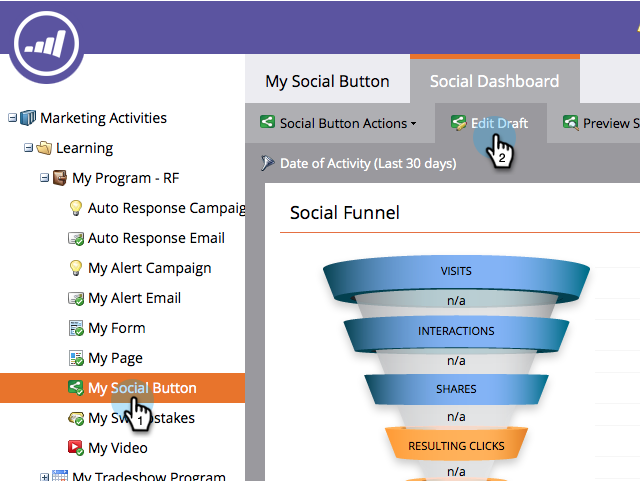

# Konfigurieren, wenn Social-Schaltfläche geöffnet wird {#configure-when-social-button-opens}

Wenn Sie eine [Social-Schaltfläche](/help/marketo/product-docs/demand-generation/landing-pages/free-form-landing-pages/add-a-social-button-to-a-free-form-landing-page.md)können Sie konfigurieren, wann die Schaltfläche die Freigabeaufforderung enthält.

1. Navigieren Sie zu **Marketingaktivitäten**.

   

1. Wählen Sie die App aus und klicken Sie auf **Entwurf bearbeiten**.

   

1. Navigieren Sie im Social-App-Editor zu **App-Einstellungen** > **Erweiterte Optionen**.

   

1. Wählen Sie aus, wann die Freigabeschaltfläche die Freigabeaufforderungen enthält.

   

   * **Bei Klick:** Wenn eine Person auf die Social-Schaltfläche klickt.
   * **Beim Laden der Seite:** Sobald die Landingpage mit der Social-Schaltfläche im Browser einer Person geladen wird.
   * **Bei Mauszeiger:** Wenn eine Person den Mauszeiger über die Social-Schaltfläche bewegt.

   >[!MORELIKETHIS]
   >
   >Nachdem die Person freigegeben wurde, können Sie ihre E-Mail-Adresse anfordern oder eine Bestätigungsnachricht senden. Erfahren Sie, wie [Konfigurieren der Eingabeaufforderungen nach der Freigabe](/help/marketo/product-docs/demand-generation/social/configuring-social-actions/configure-after-share-prompts.md).
