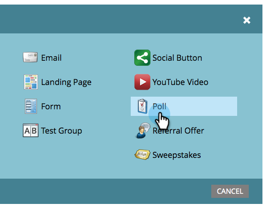
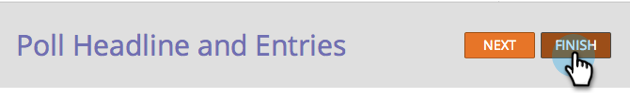

# Umfrage erstellen {#create-a-poll}

Engage Menschen mit einer Umfrage, in der sie wählen können, und mit ihren Freunden über soziale Netzwerke. Sie können sie zu Orten wie Ihren Landingpages, Ihrer Website und Facebook hinzufügen.

>[!PREREQUISITES]
>
>Wenn Sie Bilder in Ihrer Umfrage verwenden möchten, fügen Sie sie vor dem Start zu Ihrer Marketo-Bibliothek für Bilder und Dateien hinzu. Fügen Sie für jeden Umfrageeintrag ein Bild mit 60 x 60 Pixel hinzu. Siehe [Hinzufügen von Bildern und Dateien zu Marketo](/help/marketo/product-docs/demand-generation/images-and-files/add-images-and-files-to-marketo.md).

1. Wählen Sie in Ihrem Programm **Neu** > **Neues lokales Asset** aus.

   

1. Klicken Sie in der **lokalen Asset-Galerie** auf **Umfrage**.

   

1. Benennen Sie Ihre Umfrage.

   

   >[!TIP]
   >
   >Um Zeit zu sparen, können Sie die Option **Von** klonen verwenden, um alle Einstellungen aus einer vorhandenen Videofreigabe zu kopieren.

1. Geben Sie Ihrer Umfrage eine Überschrift (normalerweise eine kurze Frage).

   

1. Bearbeiten Sie für jeden Eintrag den Titel und die Beschreibung.

   

1. Um einen Eintrag hinzuzufügen, klicken Sie auf das Symbol **+** und bearbeiten Sie den Titel und die Beschreibung.

   

1. Sie können für jeden Eintrag ein Bild hinzufügen, indem Sie auf die nummerierte Miniaturansicht klicken.

   

1. Wählen Sie das benötigte Bild aus und klicken Sie dann auf **Auswählen**.

   

1. Wenn Sie die Miniaturansicht, den Titel und die Beschreibung für alle Einträge festgelegt haben, klicken Sie auf **Beenden**.

   

1. Klicken Sie auf **Genehmigen** und **Schließen.**

   

Der Umfrageeditor wird in einem neuen Fenster geöffnet. Die Standardeinstellungen sind alle gut, aber Sie müssen trotzdem Ihre Umfrageeinträge hinzufügen. Wir werden Ihnen zeigen, wie in den nächsten Schritten.

>[!TIP]
>
>Um eine der Standardeinstellungen in Ihrer Umfrage zu ändern, klicken Sie auf **Zurück**. Um Ihre Arbeit für einen späteren Zeitpunkt zu speichern, ohne sie zu genehmigen, klicken Sie auf **Schließen**.

Wenn in der Umfrage Probleme auftreten, werden Sie aufgefordert, diese zu beheben, bevor die Umfrage genehmigt wird.

>[!IMPORTANT]
>
>Eine Umfrage kann nach der Abstimmung nicht mehr bearbeitet werden.

>[!MORELIKETHIS]
>
>Der nächste Schritt besteht darin, Ihre Umfrage zu [veröffentlichen](/help/marketo/product-docs/demand-generation/social/creating-a-poll/publish-a-poll.md), Sie können jedoch bei Bedarf die Einstellungen Ihrer Umfrage ändern. Beginnen Sie mit [Anpassen der Umfrageeinstellungen](/help/marketo/product-docs/demand-generation/social/creating-a-poll/customize-poll-settings.md).
