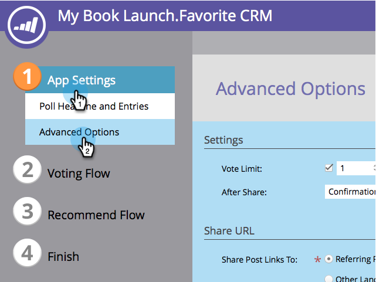
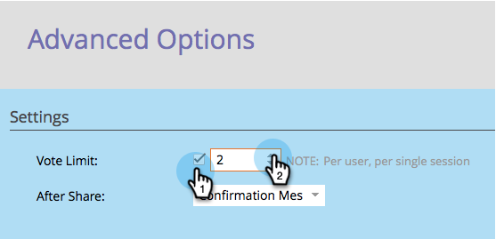

# Anpassen der Abfrageeinstellungen {#customize-poll-settings}

Wenn Sie [Umfrage erstellen](/help/marketo/product-docs/demand-generation/social/creating-a-poll/create-a-poll.md) können Sie die Anzahl der pro Social-Media-Profil zulässigen Stimmen begrenzen.

>[!IMPORTANT]
>
>Am 31. Juli 2024 haben wir mit der Einstellung dieser Funktion begonnen. Neue Assets können nicht mehr erstellt werden. Vorhandene Assets funktionieren bis zum 31. Januar 2025 weiterhin. [Weitere Informationen](https://nation.marketo.com/t5/employee-blogs/marketo-engage-social-features-deprecation/ba-p/351977){target="_blank"}

1. Navigieren Sie **Marketing-Aktivitäten**.

   

1. Wählen Sie die Abfrage aus und klicken Sie auf **Entwurf bearbeiten**.

   

1. Navigieren Sie im Abfrageeditor zu **App-Einstellungen** > **Erweiterte Optionen**.

   

1. Aktivieren Sie die Option, um eine **Stimmbegrenzung** einzuführen, und geben Sie die maximal zulässige Anzahl von Stimmen ein.

   

>[!TIP]
>
>Sie können auf **Beenden** > **Genehmigen und schließen** klicken, um [Ihre Umfrage zu veröffentlichen](/help/marketo/product-docs/demand-generation/social/creating-a-poll/publish-a-poll.md), oder Sie können sie weiter anpassen. Versuchen Sie beispielsweise, [die Eingabeaufforderungen nach der Freigabe zu konfigurieren](/help/marketo/product-docs/demand-generation/social/configuring-social-actions/configure-after-share-prompts.md).
