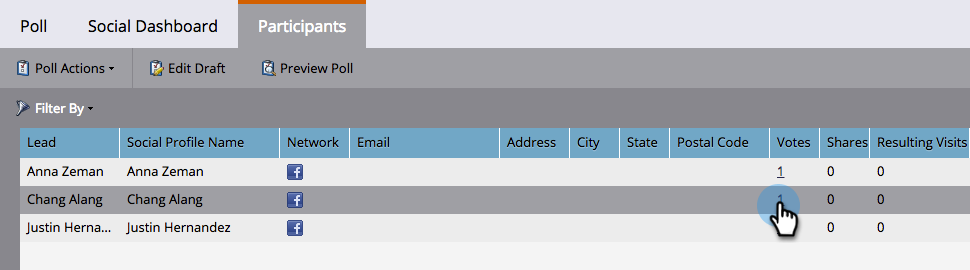

# Abstimmungen in Umfrage überprüfen {#review-votes-cast-in-poll}

Wer hat in Ihrer Umfrage für was gestimmt? Finden wir es heraus!

1. Wählen Sie in **Marketingaktivitäten** die Umfrage aus und klicken Sie auf die Registerkarte **Teilnehmer** .

   

1. Klicken Sie auf die Zahl in der Spalte **Stimmen** .

   

1. Was sie abgestimmt haben, wird angezeigt. Klicken Sie auf **Schließen**.

   

   >[!MORELIKETHIS]
   >
   >Erfahren Sie mehr über die soziale Reichweite und die Auswirkungen Ihrer Apps in [Social-Leistung anzeigen](/help/marketo/product-docs/demand-generation/social/social-functions/view-social-performance.md).
