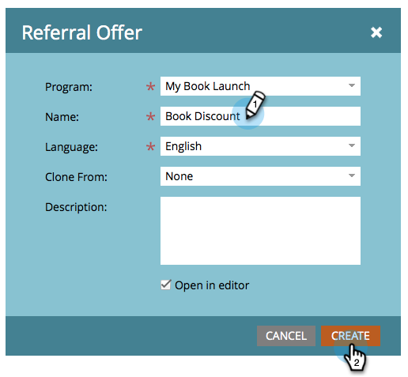
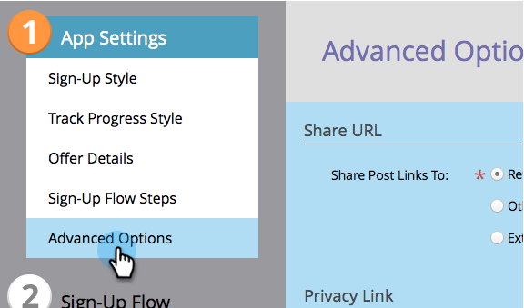

# Erstellen eines Empfehlungsangebots {#create-a-referral-offer}

Empfehlungsangebote geben Menschen einen Anreiz, ihre Freunde zu empfehlen. Erstellen Sie Ziele und Belohnungen für erfolgreiche Empfehlungen. Sie können ihn auf Landingpages, auf Ihrer Website und sogar in Facebook ablegen.

>[!IMPORTANT]
>
>Am 31. Juli 2024 haben wir mit der Einstellung dieser Funktion begonnen. Neue Assets können nicht mehr erstellt werden. Vorhandene Assets funktionieren bis zum 31. Januar 2025 weiterhin. [Weitere Informationen](https://nation.marketo.com/t5/employee-blogs/marketo-engage-social-features-deprecation/ba-p/351977){target="_blank"}

>[!AVAILABILITY]
>
>Nicht alle Marketo Engage-Benutzer haben diese Funktion erworben. Weitere Informationen erhalten Sie beim Adobe Account Team (Ihrem Account Manager).

1. Wählen Sie in Ihrem Programm **Neu** > **Neues lokales Asset**.

   

1. Klicken Sie in **Lokalen Asset** Galerie) auf **Empfehlungsangebot**.

   

1. Benennen Sie Ihr Empfehlungsangebot.

   

   >[!TIP]
   >
   >Um Zeit zu sparen, können Sie die Option **Klonen von** verwenden, um alle Einstellungen aus einem vorhandenen Empfehlungsangebot zu kopieren.

   Der Angebotseditor für Empfehlungen wird in einem neuen Fenster geöffnet. Die Standardeinstellungen sind alle gut, aber Sie müssen den Regeln (Nutzungsbedingungen) Ihres Angebots einen Link hinzufügen. Der Link wird am unteren Rand des Bildschirms Nachricht freigeben angezeigt. Wie das geht, zeigen wir Ihnen im nächsten Schritt.

1. Klicken Sie **Erweiterte Optionen**.

   

1. Fügen Sie einen Link zu den Regeln Ihres Angebots hinzu. Geben Sie die **URL** ein.

   

   >[!NOTE]
   >
   >Auf diesem Bildschirm können Sie auch einen Link zum Datenschutz hinzufügen. Siehe [Hinzufügen Ihrer Datenschutzrichtlinie zu einer Social-Media-App](/help/marketo/product-docs/demand-generation/social/social-functions/add-your-privacy-policy-to-a-social-app.md).

1. Klicken Sie auf **Fertigstellen**.

   

1. Klicken Sie **Genehmigen und schließen**.

   >[!TIP]
   >
   >Um einen der Standardwerte in Ihrem Empfehlungsangebot zu ändern, klicken Sie auf &quot;**&quot;**. Um Ihre Arbeit für einen späteren Zeitpunkt ohne Genehmigung zu speichern, klicken Sie auf **Schließen**.

   

Wenn es Probleme im Empfehlungsangebot gibt, werden Sie aufgefordert, diese zu beheben, bevor das Angebot genehmigt wird.

Herzlichen Glückwunsch! Sie haben Ihr Empfehlungsangebot erstellt.

>[!NOTE]
>
>Alle Standardeinstellungen, Zeichenfolgen und Nachrichten können geändert werden.

>[!MORELIKETHIS]
>
>Der nächste Schritt besteht darin[ Ihr Empfehlungsangebot auf ](/help/marketo/product-docs/demand-generation/social/referral-offers/publish-a-referral-offer.md) Landingpage, auf Ihrer Website oder auf Facebook zu veröffentlichen.
