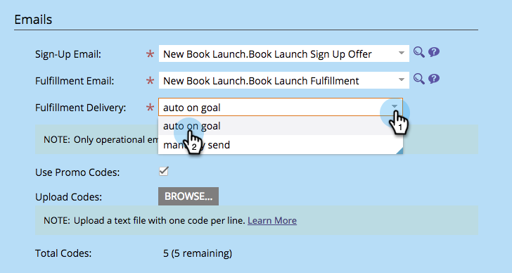

# E-Mail zur Angebotsunterbreitung senden {#send-referral-offer-fulfillment-email}

Belohnen Sie Ihre Kunden mit Gutscheinen und Rabattcodes über die E-Mail zur Angebotsabwicklung.

>[!IMPORTANT]
>
>Am 31. Juli 2024 haben wir mit der Einstellung dieser Funktion begonnen. Neue Assets können nicht mehr erstellt werden. Vorhandene Assets funktionieren bis zum 31. Januar 2025 weiterhin. [Weitere Informationen](https://nation.marketo.com/t5/employee-blogs/marketo-engage-social-features-deprecation/ba-p/351977){target="_blank"}

>[!PREREQUISITES]
>
>* [Verwenden von E-Mails in Social-Media-Promotions](/help/marketo/product-docs/demand-generation/social/social-functions/use-emails-in-social-promotions.md)
>* [Erstellen eines Empfehlungsangebots](/help/marketo/product-docs/demand-generation/social/referral-offers/create-a-referral-offer.md)

## Einrichten des Erfüllungsversands {#set-up-fulfillment-delivery}

1. Wählen Sie das Empfehlungsangebot aus. Klicken Sie **Entwurf bearbeiten**.

   

1. Wählen **unter &quot;**&quot; die Option **Angebotsdetails** aus.

   

1. Wählen Sie eine **Anmelde-E-Mail** aus.

   

1. Wählen Sie eine **Erfüllungs-E-Mail** aus.

   

   >[!NOTE]
   >
   >Erfahren Sie mehr über [Verwendung von E-Mails in sozialen Werbeaktionen](/help/marketo/product-docs/demand-generation/social/social-functions/use-emails-in-social-promotions.md).

1. Klicken Sie auf **Dropdown-Liste** Versand erfüllen“ und wählen Sie **Ziel automatisch** aus.

   

   Die in **Erfüllungs-E-Mail** ausgewählte Nachricht wird automatisch an Personen gesendet, die das Ziel erfüllen.

## Manueller Versand {#manual-send}

Sie können eine Erfüllungs-E-Mail manuell an eine Person senden, sobald diese das Ziel erreicht hat.

1. Wählen Sie das Angebot einer Empfehlung aus und klicken Sie auf **Registerkarte** Teilnehmer“.

   

1. Klicken Sie auf die **Filtern nach** und wählen Sie **Ziel** aus.

   >[!NOTE]
   >
   >Dadurch werden Personen ausgewählt, die das Ziel des Empfehlungsangebots erreicht haben.

   

1. Die Personen in der gefilterten Ansicht auswählen.

   

1. Klicken Sie mit der rechten Maustaste und wählen Sie **Erfüllungs-E-Mail senden**.

   

Fantastisch! Diese Personen erhalten nun die Erfüllungs-E-Mail und werden über ihre Belohnung angeheizt.
