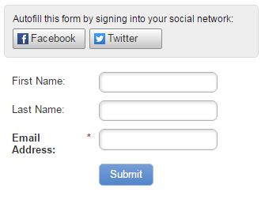

# Ausfüllen eines Social-Media-Formulars in einem Formular aktivieren (Social-Media-Formular) {#enable-social-form-fill-on-a-form-social}

Erlauben Sie Ihren Besuchern, das Formular über ihr soziales Netzwerk auszufüllen. Man erhält automatisch zusätzliche Daten und das Erlebnis ist schneller. So geht&#39;s.

>[!IMPORTANT]
>
>Am 31. Juli 2024 haben wir mit der Einstellung dieser Funktion begonnen. Neue Assets können nicht mehr erstellt werden. Vorhandene Assets funktionieren bis zum 31. Januar 2025 weiterhin. [Weitere Informationen](https://nation.marketo.com/t5/employee-blogs/marketo-engage-social-features-deprecation/ba-p/351977){target="_blank"}

>[!AVAILABILITY]
>
>Nicht alle Marketo Engage-Benutzer haben diese Funktion erworben. Weitere Informationen erhalten Sie beim Adobe Account Team (Ihrem Account Manager).

1. Navigieren Sie **Marketing-Aktivitäten**.

   

1. Wählen Sie Ihr Formular aus und klicken Sie auf **Formular bearbeiten**.

   

1. Klicken Sie unter Formulareinstellungen auf **Einstellungen**.

   

1. Markieren Sie die Schaltflächen der sozialen Netzwerke, die Sie einbeziehen möchten.

   

   >[!TIP]
   >
   >Sehen Sie sich an, welche [Daten Marketo erfassen wird](/help/marketo/product-docs/demand-generation/social/social-functions/manage-social-profile-data.md) wenn Personen die Social-Media-Schaltflächen verwenden.

1. Klicken Sie auf **Fertigstellen**.

   

1. Klicken Sie **Genehmigen und schließen**.

   

   Hier ist es.

   

Ziemlich toll, was?
