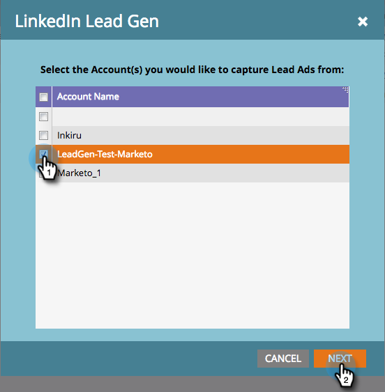

# Einrichten von Formularen für die Lead-Generierung in LinkedIn {#set-up-linkedin-lead-gen-forms}

Verwenden Sie LinkedIn Lead Gen Forms, um Anzeigenkampagnen in LinkedIn auszuführen und Leads für Marketo zu generieren.

>[!NOTE]
>
>* **Admin-Berechtigungen erforderlich**
>
>* Stellen Sie beim Erstellen von LinkedIn-Lead-Gen-Formularen sicher, dass der Formularname nicht nur numerische Zeichen enthält. Der Formularname muss entweder alphabetisch oder alphanumerisch sein.
>
>* Ein LinkedIn-Lead wird nicht in Marketo Engage aufgenommen, wenn er mit einem in Marketo vorhandenen Personendatensatz übereinstimmt, der mit einem mit Unternehmens-APIs erstellten Unternehmensdatensatz verknüpft ist, und das Marketo-Abonnement nicht mit einem CRM verbunden ist.

1. Navigieren Sie zum Bereich **[!UICONTROL Admin]**.

   

1. Wechseln Sie zu **[!UICONTROL LaunchPoint]**, klicken Sie auf **[!UICONTROL Neu]** und wählen Sie **[!UICONTROL Neuer Service]** aus.

   

1. Geben Sie _Anzeigenamen_ für Ihren Dienst ein, wählen Sie den **[!UICONTROL LinkedIn Lead Gen]**-Dienst aus der Dropdownliste aus und klicken Sie auf **[!UICONTROL Weiter]**.

   

1. Marketo öffnet eine neue Registerkarte im selben Browser unter [linkedin.com](https://www.linkedin.com){target="_blank"}. Melden Sie sich mit dem Konto, das Sie für die Integration verwenden möchten, bei LinkedIn an.

   >[!NOTE]
   >
   >Das LinkedIn-Konto benötigt Zugriff auf alle LinkedIn-Geschäftskonten, für die Sie gesponserte Kampagnen erstellen.

   

1. Kehren Sie nach der Anmeldung bei LinkedIn zu Marketo zurück und klicken Sie auf **[!UICONTROL Autorisieren]**.

   

1. Wenn Sie dazu aufgefordert werden **[!UICONTROL klicken Sie auf &quot;]**&quot;, um die Installation der Marketo-App in LinkedIn zu akzeptieren.

   

1. Sie werden feststellen, dass Sie jetzt autorisiert sind. Klicken Sie auf **[!UICONTROL Weiter]**.

   

   >[!CAUTION]
   >
   >Der Dienst läuft automatisch ein Jahr nach der Autorisierung ab. Um den Zugriff wiederherzustellen, klicken Sie einfach **[!UICONTROL Erneut autorisieren]**. Abhängig von Ihren Browsereinstellungen müssen Sie Ihr LinkedIn-Passwort möglicherweise erneut eingeben.

1. Wählen Sie die Konten aus, über die LinkedIn Lead Gen-Leads in Marketo eingehen sollen, und klicken Sie auf **[!UICONTROL Weiter]**.

   >[!TIP]
   >
   >Wenn Sie die erwarteten Geschäftskonten nicht sehen, stellen Sie sicher, dass das autorisierte LinkedIn-Konto des Benutzers über Lead-Gen-Formular-Manager-Berechtigungen für das Geschäftskonto in LinkedIn verfügt.

   

1. Um standardmäßige Feldzuordnungen von LinkedIn zu Marketo zu akzeptieren, klicken Sie einfach auf **[!UICONTROL Erstellen]**. Wenn Sie die standardmäßige Feldzuordnung ändern, eine Feldzuordnung entfernen oder eine neue Feldzuordnung hinzufügen möchten, können Sie dies für jedes Feld über das unten stehende Modal tun.

   >[!CAUTION]
   >
   >Marketo unterstützt die Zuordnung von zwei LinkedIn-Feldern zu einem einzigen Marketo _Feld, jedoch nur, wenn_ beiden LinkedIn-Felder sich nicht im selben Formular befinden. Wenn Sie zwei Felder aus demselben LinkedIn-Formular einem einzigen Marketo-Feld zuordnen, können Personen Ihre Marketo-Datenbank möglicherweise nicht eingeben.

   

   >[!NOTE]
   >
   >Nur LinkedIn-Felder, die bereits in LinkedIn[Kampagnenmanager in einer ](https://www.linkedin.com/help/lms/answer/79634){target="_blank"}Formularvorlage) gespeichert wurden, werden als LinkedIn-Felder angezeigt, die Marketo-Feldern zugeordnet werden können.

   

Gut gemacht! Personen, die LinkedIn-Lead-Gen-Formulare senden, gelangen während erfolgreicher Kampagnen auf LinkedIn in Marketo.

>[!NOTE]
>
>Sie können nur ein einzelnes LinkedIn-Benutzerkonto autorisieren. Wenn Sie mehrere Geschäftskonten haben, die Sie mit Marketo verknüpfen möchten, stellen Sie sicher, dass das autorisierte LinkedIn-Konto des Benutzers über Lead-Gen-Formular-Manager-Berechtigungen für das Geschäftskonto in LinkedIn verfügt.

>[!MORELIKETHIS]
>
>[Verwenden von LinkedIn-Lead-Gen-Formularfiltern und -Triggern in einer Smart-Kampagne](/help/marketo/product-docs/demand-generation/social/social-functions/use-linkedin-lead-gen-form-filters-and-triggers-in-a-smart-campaign.md){target="_blank"}
