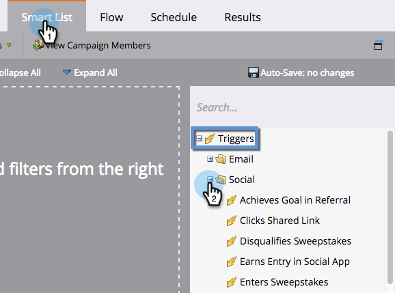

# Trigger und Filter für Social-Aktivitäten {#triggers-and-filters-for-social-activities}

Social-Apps in Marketo verfügen über eigene spezielle Trigger und Filter.

>[!IMPORTANT]
>
>Am 31. Juli 2024 begannen wir mit der Einstellung dieser Funktion. Sie können keine neuen Assets erstellen. Vorhandene Assets werden bis zum 31. Januar 2025 weiterhin funktionieren. [Weitere Informationen](https://nation.marketo.com/t5/employee-blogs/marketo-engage-social-features-deprecation/ba-p/351977){target="_blank"}

>[!AVAILABILITY]
>
>Nicht alle Marketo Engage-Benutzer haben diese Funktion erworben. Weitere Informationen erhalten Sie vom Adobe Account Team (Ihrem Kundenbetreuer).

1. Um die Social-Media-_Trigger_ zu verwenden, wählen Sie Ihre Smart-Kampagne aus und klicken Sie auf die Registerkarte **Smart-Liste** . Klicken Sie auf der rechten Seite auf + , um **Trigger** und dann **Social** zu erweitern.

   

1. Um soziale _Filter_ zu verwenden, klicken Sie auf die Schaltfläche **+** , um die **Filter** zu erweitern.

   

1. Referenzieren Sie die unten stehende Tabelle, um zu sehen, welche Trigger und Filter mit den einzelnen Social-Apps funktionieren.

   | Trigger/Filter | Social-Buttons | Umfragen | Videos | Empfehlungsangebote | Gewinnspiele |
   |---|---|---|---|---|---|
   | Ziel in Empfehlung erreicht |  |  |  |  | |
   | Gibt Inhalt frei |  |  |  |  |  |
   | Klickt auf freigegebenen Link |  |  |  |  |  |
   | Disqualifiziert Gewinnspiele |  |  |  |  |  |
   | Erhält Einträge in Social App |  |  |  |  |  |
   | Gibt Gewinnspiele ein |  |  |  |  |  |
   | Verweist auf Social App |  |  |  |  |  |
   | Registriert sich für Empfehlungsangebot |  |  |  |  |  |
   | Nimmt an Umfrage teil |  |  |  |  |  |
   | Gewinnt Gewinnspiele |  |  |  |  |  |

   >[!MORELIKETHIS]
   >
   >[Soziale Leistung anzeigen](/help/marketo/product-docs/demand-generation/social/social-functions/view-social-performance.md)
