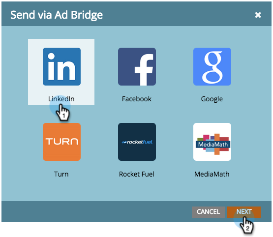

# Verwenden einer Marketo-Liste oder Smart-Liste als LinkedIn-Zielgruppensegment {#use-a-marketo-list-or-smart-list-as-a-linkedin-audience-segment}

Integrieren Sie Ihre Marketo Engage-Mitarbeiter mit Ihren LinkedIn-Zielgruppen.

>[!PREREQUISITES]
>
>[Hinzufügen von abgeglichenen LinkedIn-Zielgruppen als LaunchPoint-Service](/help/marketo/product-docs/demand-generation/ad-network-integrations/add-linkedin-matched-audiences-as-a-launchpoint-service.md){target="_blank"}

1. Navigieren Sie zur **[!UICONTROL Datenbank]**.

   

1. Smart-Liste auswählen.

   

1. Klicken Sie auf die **[!UICONTROL Personen]**.

   

1. Klicken Sie auf das _Über Ad Bridge senden_ Symbol  unten in der Liste.

   

   >[!NOTE]
   >
   >Bei Verwendung von Anzeigennetzwerkintegrationen zum Senden einer Zielgruppe an LinkedIn sendet Marketo nur die E-Mail-Adresse.

1. Wählen Sie **[!UICONTROL LinkedIn]** aus und klicken Sie auf **[!UICONTROL Weiter]**.

   

1. Wählen Sie eine _LinkedIn-Zielgruppe_.

   >[!NOTE]
   >
   >Durch Klicken auf **[!UICONTROL +Neue Zielgruppe]** eine Zielgruppe in LinkedIn Campaign Manager erstellt.

   

   >[!NOTE]
   >
   >LinkedIn hat die APIs für den Push-Typ „Zielgruppe löschen und Leads hinzufügen“ im März 2018 eingestellt. Diese Option ist ab Marketos Version 1. Quartal 2018 nicht mehr verfügbar.

1. Wählen Sie einen _[!UICONTROL Push-Typ]_ aus. Klicken Sie auf **[!UICONTROL Aktualisieren]**.

   

   >[!NOTE]
   >
   >Bitte warten Sie 15 Minuten, bis die Synchronisierung stattfindet.

High Five! Ihre Daten werden jetzt mit den LinkedIn-Zielgruppen übereinstimmen. Informationen zum Hochladen von Listen für Konto- und Kontakt-Targeting in LinkedIn finden Sie [LinkedIn&#39;s Marketing Solutions Help Center](https://www.linkedin.com/help/lms/answer/73938?query=ad%20segment){target="_blank"}.
