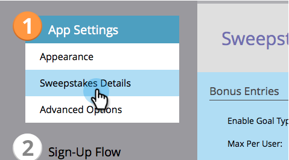
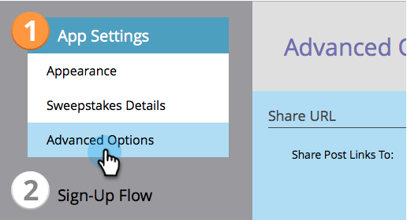

# Gewinnspiele erstellen {#create-sweepstakes}

Ein Preisausschreiben gibt den Leuten die Möglichkeit, einen Preis zu gewinnen, der ihnen dafür zuteil wird, dass sie ihren Freunden von Ihnen erzählt haben. Sie können sie auf Landingpages, auf Ihrer Website und sogar in Facebook ablegen.

>[!AVAILABILITY]
>
>Nicht alle Marketo Engage-Benutzer haben diese Funktion erworben. Weitere Informationen erhalten Sie vom Adobe Account Team (Ihrem Kundenbetreuer).

1. Wählen Sie im Programm die Option **Neu** > **Neues lokales Asset**.

   

1. Klicken Sie in der lokalen Asset-Galerie auf **Preisausschreiben**.

   

1. Nennen Sie Ihr Gewinnspiel.

   

   >[!TIP]
   >
   >Um Zeit zu sparen, können Sie die **Klonen von** -Option, um alle Einstellungen aus einem vorhandenen Gewinnspiel zu kopieren.

   Der Gewinnspiel-Editor wird in einem neuen Fenster geöffnet. Die Standardeinstellungen sind alle gut, aber Sie müssen dennoch einige Details konfigurieren. Wir zeigen Ihnen wie in den nächsten Schritten.

1. Klicks **Details zu Preisausschreiben**.

   

1. Wählen Sie die Häufigkeit, das Start- und Enddatum sowie Ihre Zeitzone aus.

   

   >[!NOTE]
   >
   >Für tägliche und wöchentliche Zeichnungen sind die Start- und Endzeiten jeweils um 12 Uhr bzw. 23:59 Uhr festgelegt. Für eine einmalige Zeichnung können Sie Ihre eigenen Start- und Endzeiten wählen.

1. Klicks **Erweiterte Optionen**.

   

1. Fügen Sie einen Link zu den Regeln Ihres Gewinnspiels hinzu. Geben Sie die URL ein. Dieser Link ist erforderlich.

   

   Der Link wird unten auf den Bildschirmen zur Freigabe von Nachrichten angezeigt.

   >[!NOTE]
   >
   >Auf diesem Bildschirm können Sie auch einen Link zu Datenschutzrichtlinien hinzufügen. Siehe [Hinzufügen Ihrer Datenschutzrichtlinie zu einer Social App](/help/marketo/product-docs/demand-generation/social/social-functions/add-your-privacy-policy-to-a-social-app.md).

1. Klicks **Beenden**.

   

1. Klicks **Genehmigen und schließen**.

   

   >[!TIP]
   >
   >Um eine der Standardeinstellungen in Ihrem Gewinnspiel zu ändern, klicken Sie auf **Zurück**. Um Ihre Arbeit für einen späteren Zeitpunkt ohne Genehmigung zu speichern, klicken Sie auf **Schließen**.

Wenn Probleme beim Gewinnspiel auftreten, werden Sie aufgefordert, diese zu beheben, bevor der Gewinnspiel genehmigt wird.

Herzlichen Glückwunsch! Sie haben ein Preisausschreiben erstellt.

>[!MORELIKETHIS]
>
>Der nächste Schritt besteht darin, [Preisausschreiben veröffentlichen](/help/marketo/product-docs/demand-generation/social/sweepstakes/publish-a-sweepstakes.md), aber Sie können das Erscheinungsbild und die Einstellungen Ihres Gewinnspiels ändern. Beginnen mit [Anpassen der Gewinnspielstile](/help/marketo/product-docs/demand-generation/social/sweepstakes/customize-sweepstakes-styles.md).
