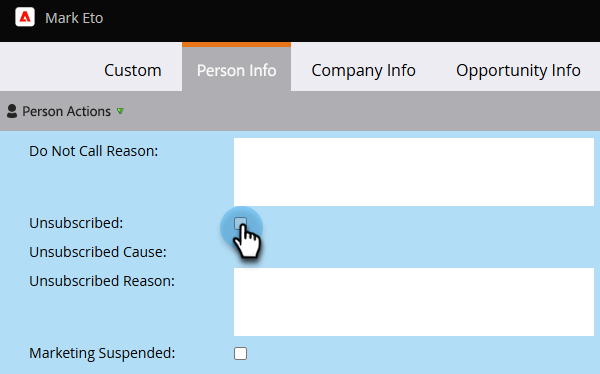

# Dauerhafte Abmeldung {#durable-unsubscribe}

Marketo hat das Verhalten der Abmeldefunktion verbessert, sodass sie „dauerhaft“ ist. Wir haben einen Master-E-Mail-Status hinzugefügt, der getrennt von der Abmelde-Markierung ist, die im Personendetaildatensatz sichtbar ist.

Wenn für das Abmelde-Flag „false“ die Einstellung „true“ festgelegt ist, wird der Master-E-Mail-Status aktualisiert und die Änderung wird an andere Personen mit derselben E-Mail-Adresse weitergegeben. Wenn eine Person entfernt und neu erstellt wird oder wenn ein neuer Datensatz mit derselben E-Mail-Adresse erstellt wird, wird das Abmelde-Flag **nicht** überschrieben.

>[!NOTE]
>
>Eine dauerhafte Abmeldung funktioniert auf allen Partitionen in der gesamten Marketo-Datenbank.

## Aktualisieren Sie das Abmelde-Flag von „True“ auf „False“ (z. B. erneutes Abonnieren einer Person). {#update-the-unsubscribe-flag-from-true-to-false-e-g-re-subscribe-a-person}

Es gibt mehrere Möglichkeiten, wie eine Person erneut abonniert werden kann.

Löschen **in Salesforce** Feld E-Mail-Abmeldung im Datensatz des Leads/Kontakts. Dadurch wird mit Marketo synchronisiert.

Deaktivieren **in Marketo** Feld Abgemeldet auf der Registerkarte Info des Datensatzes der Person.

Führen Sie einen **Datenwert ändern**-Flussschritt wie unten gezeigt auf einem oder mehreren Personen aus.

Vorhandene Person über die SOAP-API aktualisieren.

## Erstellen einer neuen Person {#creating-a-new-person}

Wenn eine neue Person erstellt wird, vergleicht Marketo sie mit der übergeordneten E-Mail-Statustabelle. Wenn die Person sich zuvor abgemeldet hat, aktualisieren wir den Eintrag, der abgemeldet werden soll.

## E-Mail-Adresse ändern {#changing-an-email-address}

Wenn Sie die E-Mail-Adresse einer Person in eine abgemeldete E-Mail-Adresse ändern, wird diese Person abgemeldet. Diese Änderung kann entweder in Marketo oder in Salesforce vorgenommen werden.

## Erneute Anmeldung {#re-subscribing}

Genau wie eine Abmeldung dazu führen würde, dass alle Personen mit derselben E-Mail-Adresse ihr Abonnement kündigen, würde eine Rückabmeldung tatsächlich jede Person mit derselben E-Mail-Adresse erneut abonnieren.

>[!MORELIKETHIS]
>
>[Grundlagen zum Abmelden](/help/marketo/product-docs/email-marketing/deliverability/understanding-unsubscribe.md)
