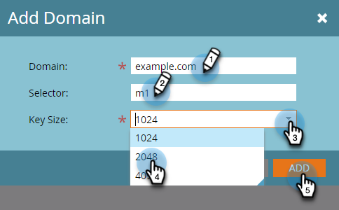

# Einrichten einer benutzerdefinierten DKIM-Signatur {#set-up-a-custom-dkim-signature}

Um die Zustellbarkeit auf höchstem Niveau zu gewährleisten, signieren wir automatisch alle ausgehenden E-Mails mit einer freigegebenen Marketo DKIM-Signatur.

>[!NOTE]
>
>Möglicherweise benötigen Sie die Hilfe Ihres IT-Teams, um einige der Schritte in diesem Artikel durchzuführen.

Sie können die DKIM-Signatur personalisieren, um die Domäne(n) Ihrer Wahl widerzuspiegeln. So geht es.

1. Wechseln Sie zum Abschnitt **Admin** .

   

   >[!NOTE]
   >
   >Wenn Sie eine benutzerdefinierte DKIM-Signatur auf die altmodische Art einrichten, funktioniert sie weiterhin und sollte hier angezeigt werden.

1. Klicken Sie auf **E-Mail**.

   

1. Klicken Sie auf die Registerkarte **SPF/DKIM** und dann auf **Domäne hinzufügen**.

   

1. Geben Sie die Domäne ein, die Sie in Marketo-E-Mails als Absenderadresse verwenden werden. Wählen Sie einen Selektor und eine Schlüsselgröße. Klicken Sie abschließend auf **Hinzufügen** .

   

   <table> 
   <tr>
   <td width="20%"><b>Selektor</b></td>
   <td>Eine eindeutige Zeichenfolge/Kennung, die zum Suchen des öffentlichen Schlüsselteils des DKIM-Datensatzes verwendet wird. Es kann sich um eine beliebige Zeichenfolge oder eine eindeutige Kennung handeln, um den Zweck dieses DKIM-Schlüssels/Datensatzes zu trennen und ihn zu identifizieren.</td>
   </tr>
   <tr> 
   <td width="20%"><b>Schlüsselgröße</b></td>
   <td>Die Sicherheitsstufe, mit der Ihre DKIM-Signatur verschlüsselt werden soll.</td>
   </tr>
   </tbody>
   </table>

   

   >[!TIP]
   >
   >* Wir empfehlen eine Schlüsselgröße von 2048.
   >* Wenn Sie eine andere Domäne in Ihrer Absenderadresse verwenden, verwenden wir die von Marketo freigegebene DKIM-Signatur.

   >[!IMPORTANT]
   >
   >Wenn Sie entweder den DKIM-Selektor oder die DKIM-Verschlüsselungsgröße für Ihre Domäne aktualisieren müssen, müssen Sie Ihren vorhandenen Datensatz löschen und den neu generierten Datensatz mit den neuen Werten erneut veröffentlichen.
   >
   >Bitte beachten Sie, dass DKIM nicht für Ihre Domain signiert wird, bis Ihr neuer Datensatz von unserem System veröffentlicht und validiert wird. Planen Sie Ihre Änderung entsprechend, da es 24 bis 48 Stunden dauern kann, bis der neue DKIM-Datensatz vollständig über das Internet übertragen wird.

1. Senden Sie den **Host-Datensatz** und den **TXT-Wert** an Ihre IT. Bitten Sie sie, den Datensatz für Sie zu erstellen und sicherzustellen, dass er an alle Nameserver propagiert wird, die mit der von -Domäne verknüpft sind. Die DKIM-Verifizierung von Marketo erfordert, dass der DKIM-Schlüssel an alle Nameserver weitergegeben wird, die mit der Domäne verknüpft sind, die von DKIM signiert wurde.

   

1. Nachdem er bestätigt hat, dass er den Datensatz erstellt hat, kehren Sie zu Marketo zurück, wählen Sie Ihre Domäne aus und klicken Sie auf **DNS überprüfen**.

   

   >[!NOTE]
   >
   >Wenn die Bestätigung fehlschlägt und Ihre IT-Abteilung den Datensatz korrekt erstellt hat, kann es sich um eine DNS-Weiterleitung handeln. Versuchen Sie es später erneut.

   >[!CAUTION]
   >
   >Das Ändern/Entfernen des entsprechenden DNS-Eintrags beeinträchtigt die Zustellbarkeit. Löschen Sie den Eintrag in Marketo, bevor Sie DNS-Änderungen vornehmen.

   Dies hilft bei der Zustellbarkeit Ihrer E-Mail. Sie sollten die Validierung erhalten, dass der Datensatz vorhanden ist und korrekt ist.
