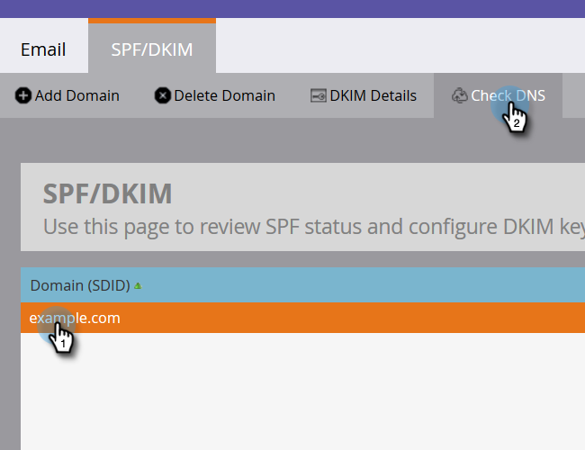

# Einrichten einer benutzerdefinierten DKIM-Signatur {#set-up-a-custom-dkim-signature}

Um eine erstklassige Zustellbarkeit zu gewährleisten, signieren wir automatisch alle ausgehenden E-Mails mit einer gemeinsamen Marketo DKIM-Signatur.

>[!NOTE]
>
>Möglicherweise benötigen Sie die Hilfe Ihres IT-Teams, um einige der Schritte in diesem Artikel durchzuführen.

Sie können die DKIM-Signatur personalisieren, um die Domäne(n) Ihrer Wahl widerzuspiegeln. So geht es.

1. Gehen Sie zum Abschnitt **Admin**.

   

   >[!NOTE]
   >
   >Wenn Sie eine benutzerdefinierte DKIM-Signatur auf die altmodische Weise einrichten, funktioniert sie weiterhin und sollte hier angezeigt werden.

1. Klicken Sie auf **E-Mail**, dann auf die Registerkarte **DKIM** und schließlich **Hinzufügen Domäne**.

   

1. Geben Sie die Domäne ein, die Sie in Marketing-E-Mails als &quot;Von-Adresse&quot;verwenden möchten, und klicken Sie auf **Hinzufügen**.

   >[!TIP]
   >
   >Wenn Sie eine andere Domäne in Ihrer Von-Adresse verwenden, verwenden wir die freigegebene DKIM-Signatur von Marketo.

   

1. Senden Sie den **Hostdatensatz** und den **TXT-Wert** an Ihre IT. Bitten Sie sie, den Datensatz für Sie zu erstellen und sicherzustellen, dass er an alle Nameserver weitergegeben wird, die mit der from-Domäne verknüpft sind. Zur DKIM-Verifizierung von Marketo muss der DKIM-Schlüssel an alle Nameserver weitergegeben werden, die mit der Domäne verbunden sind, die DKIM-signiert ist.

   

1. Sobald der Benutzer bestätigt hat, dass er den Datensatz erstellt hat, kehren Sie zu Marketo zurück, wählen Sie Ihre Domäne und klicken Sie auf **DNS** prüfen.

   

   >[!NOTE]
   >
   >Wenn die Bestätigung fehlschlägt und Ihre IT-Abteilung den Datensatz richtig erstellt hat, kann es sich um DNS-Weiterleitung handeln. Versuchen Sie es später noch einmal.

   >[!CAUTION]
   >
   >Das Ändern/Entfernen des entsprechenden DNS-Datensatzes beeinträchtigt die Lieferbarkeit. Achten Sie darauf, den Eintrag in Marketo zu löschen, bevor Sie DNS-Änderungen vornehmen.

   Dies hilft Ihnen bei der Zustellung Ihrer E-Mail. Sie sollten die Bestätigung erhalten, dass der Datensatz vorhanden ist und korrekt ist.
