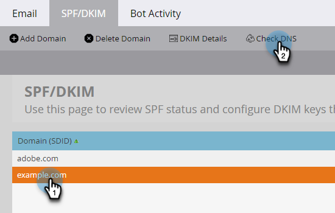

# Einrichten einer benutzerdefinierten DKIM-Signatur {#set-up-a-custom-dkim-signature}

Um eine optimale Zustellbarkeit zu gewährleisten, signiert Marketo automatisch alle ausgehenden E-Mails mit einer freigegebenen DKIM-Signatur.

>[!NOTE]
>
>Möglicherweise benötigen Sie die Hilfe Ihres IT-Teams, um einige der Schritte in diesem Artikel auszuführen.

Sie können die DKIM-Signatur personalisieren, um die Domain(s) Ihrer Wahl widerzuspiegeln.

1. Navigieren Sie zum Abschnitt **[!UICONTROL Admin]**.

   

   >[!NOTE]
   >
   >Wenn Sie eine benutzerdefinierte DKIM-Signatur mit der Legacy-Methode einrichten, funktioniert sie weiterhin und sollte hier angezeigt werden.

1. Klicken Sie auf **E-Mail**.

   

1. Klicken Sie auf die **SPF/DKIM** und dann auf **Domain hinzufügen**.

   

1. Geben Sie als Absenderadresse die Domain ein, die Sie in Marketo-E-Mails verwenden werden. Wählen Sie einen Selektor und eine Schlüsselgröße aus. Klicken Sie abschließend **Hinzufügen**.

   

   <table>
   <tr>
   <td width="20%"><b>Selektor</b></td>
   <td>Eine eindeutige Zeichenfolge/Kennung, die verwendet wird, um den öffentlichen Schlüsselteil des DKIM-Eintrags zu finden. Es kann sich um eine beliebige Zeichenfolge oder eine eindeutige Kennung handeln, um den Zweck dieses DKIM-Schlüssels/Datensatzes zu trennen und zu identifizieren.</td>
   </tr>
   <tr>
   <td width="20%"><b>Schlüsselgröße</b></td>
   <td>Die Sicherheitsstufe, mit der Ihre DKIM-Signatur verschlüsselt werden soll.</td>
   </tr>
   </tbody>
   </table>

   

   >[!TIP]
   >
   >* Eine Schlüsselgröße von 2048 wird empfohlen.
   >* Wenn Sie eine andere Domain in Ihrer Absenderadresse verwenden, verwendet Marketo die freigegebene DKIM-Signatur.

   >[!IMPORTANT]
   >
   >Wenn Sie entweder den DKIM-Selektor oder die DKIM-Verschlüsselungsgröße für Ihre Domain aktualisieren müssen, müssen Sie den vorhandenen Eintrag löschen und den neu generierten Eintrag mit den neuen Werten erneut veröffentlichen.
   >
   >Dabei wird DKIM erst dann für Ihre Domain signiert, wenn Ihr neuer Eintrag veröffentlicht und von unserem System validiert wurde. Planen Sie Ihre Änderung entsprechend, da es 24 bis 48 Stunden dauern kann, bis der neue DKIM-Eintrag vollständig über das Internet verbreitet wird.

1. Senden Sie den **[!UICONTROL Hosteintrag]** und den **[!UICONTROL TXT-Wert]** an Ihre IT. Bitten Sie sie, den Datensatz für Sie zu erstellen und sicherzustellen, dass er sich an alle Nameserver weitergibt, die mit der Formular-Domain verknüpft sind. Die DKIM-Überprüfung von Marketo erfordert, dass der DKIM-Schlüssel an alle Nameserver weitergegeben wird, die mit der Domain verknüpft sind, die DKIM-signiert wird.

   

1. Nachdem der Benutzer bestätigt hat, dass er den Eintrag erstellt hat, kehren Sie zu Marketo zurück, wählen Sie Ihre Domain aus und klicken Sie auf **[!UICONTROL DNS überprüfen]**.

   

   >[!NOTE]
   >
   >Wenn die Bestätigung fehlschlägt und Ihre IT den Eintrag korrekt erstellt hat, kann es sich um eine DNS-Übertragung handeln. Versuchen Sie es später erneut.

   >[!CAUTION]
   >
   >Das Ändern/Entfernen des entsprechenden DNS-Eintrags beeinträchtigt die Zustellbarkeit. Löschen Sie den Eintrag in Marketo, bevor Sie DNS-Änderungen vornehmen.

   Dies verbessert die Zustellbarkeit Ihrer E-Mails. Sie sollten überprüfen lassen, ob der Datensatz vorhanden und korrekt ist.
