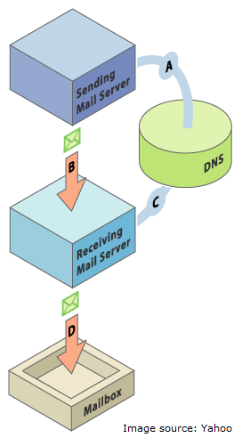

# Einrichten von SPF und DKIM für Ihre E-Mail-Zustellbarkeit {#set-up-spf-and-dkim-for-your-email-deliverability}

Eine schnelle Methode zur Verbesserung Ihrer E-Mail-Versandraten besteht darin, **SPF** (Sender Policy Framework) und **DKIM** (Domain Keys Identified Mail) in Ihre DNS-Einstellungen zu integrieren. Zusätzlich zu Ihren DNS-Einträgen teilen Sie den Empfängern mit, dass Sie Marketo zum Versand von E-Mails in Ihrem Namen autorisiert haben. Ohne diese Änderung besteht eine höhere Wahrscheinlichkeit, dass Ihre E-Mail als Spam gekennzeichnet wird, da die E-Mail von Ihrer Domain aus, aber von einer IP-Adresse mit einer Marketo-Domain gesendet wurde.

>[!CAUTION]
>
>Sie benötigen Ihren Netzwerkadministrator, um diese Änderung in Ihrem DNS-Eintrag vorzunehmen.

## Einrichten von SPF {#set-up-spf}

**Wenn Sie keinen SPF-Eintrag in Ihrer Domäne haben**

Bitten Sie Ihren Netzwerkadministrator, die folgende Zeile zu Ihren DNS-Einträgen hinzuzufügen. Ersetzen Sie [Domäne] durch die Hauptdomäne Ihrer Website (z. B. &quot;company.com&quot;) und [corpIP] mit der IP-Adresse Ihres Unternehmens-E-Mail-Servers (z. B. &quot;255.255.255.255&quot;). Wenn Sie E-Mails von mehreren Domänen über Marketo senden, sollten Sie diese zu jeder Domäne hinzufügen (in einer Zeile).

`[domain] IN TXT v=spf1 mx ip4:[corpIP] include:mktomail.com ~all`

**Wenn Sie einen SPF-Eintrag in Ihrer Domäne haben**

Wenn Sie bereits einen SPF-Eintrag in Ihrem DNS-Eintrag haben, fügen Sie Folgendes hinzu:

include:mktomail.com

## Einrichten von DKIM {#set-up-dkim}

**Was ist DKIM? Warum möchte ich DKIM einrichten?**

DKIM ist ein Authentifizierungsprotokoll, das von E-Mail-Empfängern verwendet wird, um festzustellen, ob eine E-Mail-Nachricht von wem gesendet wurde, von dem angegeben wurde, dass sie gesendet wurde. DKIM verbessert oft die Zustellbarkeit von E-Mails an den Posteingang, da ein Empfänger sicher sein kann, dass die Nachricht keine Fälschung ist.

**Wie funktioniert DKIM?**

Nachdem Sie den öffentlichen Schlüssel in Ihrem DNS-Eintrag eingerichtet und die sendende Domain im Admin-Abschnitt (A) aktiviert haben, aktivieren wir die benutzerdefinierte DKIM-Signatur für Ihre ausgehenden Nachrichten, die eine verschlüsselte digitale Signatur mit jeder E-Mail enthält, die wir für Sie senden (B). Die Empfänger können die digitale Signatur entschlüsseln, indem sie den &quot;öffentlichen Schlüssel&quot;im DNS (C) Ihrer sendenden Domain suchen. Wenn der Schlüssel in der E-Mail mit dem Schlüssel in Ihrem DNS-Eintrag übereinstimmt, wird der E-Mail-Empfangs-Server die in Ihrem Namen gesendete E-Mail-Marketo mit höherer Wahrscheinlichkeit akzeptieren.

**Wie richte ich DKIM ein?**

Weitere Informationen finden Sie unter [Einrichten einer benutzerdefinierten DKIM-Signatur](/help/marketo/product-docs/email-marketing/deliverability/set-up-a-custom-dkim-signature.md){target="_blank"}.

>[!MORELIKETHIS]
>
>* [Weitere Informationen zu SPF und dessen Funktionsweise](http://www.open-spf.org/Introduction/){target="_blank"}
>* [Ist mein SPF korrekt eingerichtet?](https://www.kitterman.com/spf/validate.html){target="_blank"}
>* [Habe ich die richtige Syntax verwendet?](http://www.open-spf.org/SPF_Record_Syntax/){target="_blank"}
