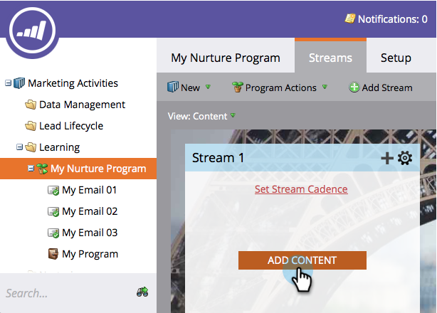
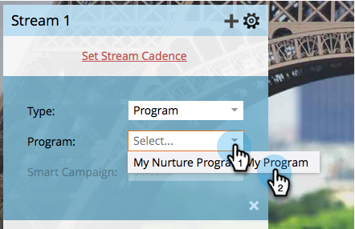
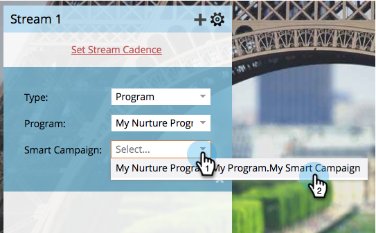
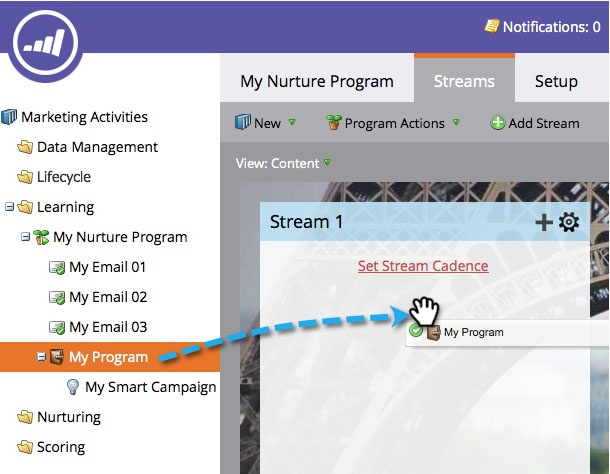

# hinzufügen von Inhalten in einem Stream {#add-content-to-a-stream}

Nachdem Sie Ihr Interaktions-Programm erstellt haben, müssen Sie dem bzw. den Streams Inhalte hinzufügen. Sie können einem Stream E-Mails oder Programme hinzufügen.

## hinzufügen einer E-Mail an einen Stream {#add-an-email-to-a-stream}

1. Gehen Sie zu **Marketing-Aktivitäten**.

   

1. Wählen Sie Ihr Interaktions-Programm aus und gehen Sie zur Registerkarte **Streams** .

   

   Sie können die erste E-Mail auf drei verschiedene Arten hinzufügen:

**Schaltfläche &quot;Hinzufügen&quot;**

1. Klicken Sie auf die Schaltfläche **Hinzufügen Inhalt** .

   

1. Lassen Sie den **Typ** auf **E-Mail** einstellen und wählen Sie dann die E-Mail-Adresse aus, die Sie hinzufügen möchten.

   

   >[!TIP]
   >
   >Die lokalen E-Mails zu diesem Programm werden oben sortiert.

**Stream + Symbol**

1. Klicken Sie auf das Symbol für Streams **+** , lassen Sie **Type** als **E-Mail** stehen und wählen Sie die E-Mail aus, die Sie hinzufügen möchten.

   

**Drag &amp; Drop**

1. Ziehen Sie einfach die E-Mail aus dem Baum in den Stream.

   

## Programm in einen Stream Hinzufügen {#add-a-program-to-a-stream}

1. Gehen Sie zu **Marketing-Aktivitäten**.

   

1. Wählen Sie Ihr Interaktions-Programm aus und gehen Sie zur Registerkarte **Streams** .

   

   Sie können dem Stream auf drei verschiedene Arten ein Programm hinzufügen:

**Schaltfläche &quot;Hinzufügen&quot;**

1. Klicken Sie auf **Hinzufügen Inhalt**.

   

1. Ändern Sie **den Typ** in Programm.

   

1. Suchen und wählen Sie das Programm aus.

   

1. Wählen Sie die intelligente Kampagne im Programm aus, durch die die Leute laufen sollen.

   

   >[!NOTE]
   >
   >**Erinnerung**
   >
   >
   >Für die intelligente Kampagne muss der Filter **Member of Engagement Programm** enthalten sein, damit dies ordnungsgemäß funktioniert.

**Stream + Symbol**

1. Klicken Sie auf das Symbol stream **+** und ändern Sie **Type** in Programm.

   

1. Suchen und wählen Sie Ihr Programm aus.

   

1. Wählen Sie die intelligente Kampagne aus, in der die Personen verarbeitet werden sollen.

   

**Drag &amp; Drop**

1. Ziehen Sie das Programm Ihrer Wahl aus dem Baum in Ihren Stream.

   

1. Wählen Sie einfach die intelligente Kampagne aus, durch die Menschen fließen sollen.

   

Gute Arbeit! Sie kennen jetzt verschiedene Möglichkeiten, Programm-Streams Inhalte hinzuzufügen. hinzufügen so viele, wie du für deine Pflege brauchst. Weitere Informationen finden Sie im entsprechenden Artikel unten.

>[!NOTE]
>
>**Verwandte Artikel**
>
>* [Hinzufügen eines Programms zu einem Interaktions-Programm-Stream](adding-a-program-to-an-engagement-program-stream.md)

>

