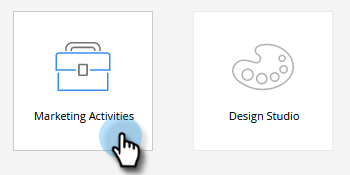
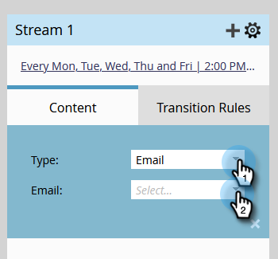
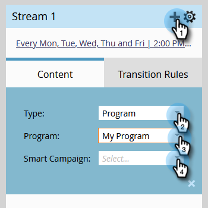

# Hinzufügen von Inhalten zu einem Stream {#add-content-to-a-stream}

Nachdem Sie Ihr Interaktionsprogramm erstellt haben, müssen Sie dem Stream Inhalte hinzufügen. Sie können E-Mails oder Programme zu einem Stream hinzufügen.

1. Navigieren Sie zu **[!UICONTROL Marketing-Aktivitäten]**.

   

1. Wählen Sie Ihr Interaktionsprogramm aus und wechseln Sie zur Registerkarte **[!UICONTROL Streams]** .

   

   Sie können Inhalte auf zwei verschiedene Arten hinzufügen:

**Schaltfläche „Inhalt hinzufügen“**

1. Klicken Sie auf **[!UICONTROL Schaltfläche]** Inhalt hinzufügen“.

   

1. Wählen Sie **[!UICONTROL E]** Mail _oder_ **[!UICONTROL Programm]** und wählen Sie dann die E-Mail-Adresse oder das Programm/die Smart-Kampagne aus, die Sie hinzufügen möchten.

   

   >[!TIP]
   >
   >Die für dieses Interaktionsprogramm lokalen E-Mails werden oben sortiert.

**+-Symbol**

1. Klicken Sie auf das Symbol **+**, wählen Sie **[!UICONTROL E-Mail]** _oder_**[!UICONTROL Programm]** und dann die E-Mail-Adresse oder das Programm/die intelligente Kampagne aus, die Sie hinzufügen möchten.

   

   >[!NOTE]
   >
   >Eine intelligente Kampagne muss den Filter **[!UICONTROL Mitglied des Interaktionsprogramms]** enthalten, damit sie ordnungsgemäß funktioniert.

>[!MORELIKETHIS]
>
>[Hinzufügen eines Programms zu einem Interaktionsprogramm-Stream](/help/marketo/product-docs/email-marketing/drip-nurturing/creating-an-engagement-program/adding-a-program-to-an-engagement-program-stream.md)
