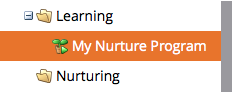

# Erstellen eines Interaktionsprogramms {#create-an-engagement-program}

Sie können Interaktionsprogramme in Marketo verwenden, um E-Mail-Pflege zu erleichtern.

1. Wechseln Sie zu **Marketingaktivitäten**.

   

1. Wählen Sie den Ordner aus, in dem Sie das Interaktionsprogramm erstellen möchten, und klicken Sie dann auf **Neu** und **Neues Programm**.

   

1. Geben Sie einen **Namen** ein, wählen Sie **Interaktion** für **Programmtyp** aus und klicken Sie auf **Erstellen**.

   

1. Gut, jetzt, da Sie ein Interaktionsprogramm haben, lassen Sie uns fortfahren und es anziehen.

   

   >[!MORELIKETHIS]
   >
   >* [Inhalt zu einem Stream hinzufügen](/help/marketo/product-docs/email-marketing/drip-nurturing/creating-an-engagement-program/add-content-to-a-stream.md)
   >* [Stream-Kadenz festlegen](/help/marketo/product-docs/email-marketing/drip-nurturing/engagement-program-streams/set-stream-cadence.md)
