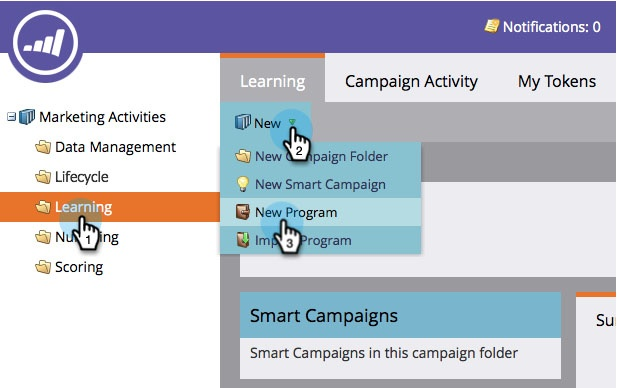

# Erstellen eines Interaktionsprogramms {#create-an-engagement-program}

Sie können Interaktionsprogramme in Marketo verwenden, um E-Mail-Nurturing ohne großen Aufwand durchzuführen.

1. Navigieren Sie zu **[!UICONTROL Marketing-Aktivitäten]**.

   

1. Wählen Sie den Ordner aus, in dem Sie das Interaktionsprogramm erstellen möchten, und klicken Sie dann auf **[!UICONTROL Neu]** und **[!UICONTROL Neues Programm]**.

   

1. Geben Sie einen **[!UICONTROL Namen]** ein, wählen Sie **[!UICONTROL Interaktion]** als **[!UICONTROL Programmtyp]** aus und klicken Sie auf **[!UICONTROL Erstellen]**.

   

   

   >[!MORELIKETHIS]
   >
   >* [Hinzufügen von Inhalten zu einem Stream](/help/marketo/product-docs/email-marketing/drip-nurturing/creating-an-engagement-program/add-content-to-a-stream.md)
   >* [Festlegen einer Stream-Kadenz](/help/marketo/product-docs/email-marketing/drip-nurturing/engagement-program-streams/set-stream-cadence.md)
