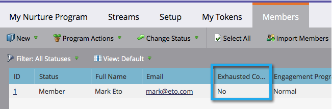

# Grundlegendes zu Interaktionsprogrammen {#understanding-engagement-programs}

Interaktionsprogramme sind so konzipiert, dass sie neuen Personen Inhalte systematisch präsentieren.

>[!NOTE]
>
>Pro Abonnement sind maximal 100 **aktive** Interaktionsprogramme zulässig.

## Interaktionsprogramm {#engagement-program}

Ein **Interaktionsprogramm** ist eine Art Programm, das auf einfache Weise komplexe Pflege durchführen kann.

>[!MORELIKETHIS]
>
>[Erstellen eines Interaktionsprogramms](/help/marketo/product-docs/email-marketing/drip-nurturing/creating-an-engagement-program/create-an-engagement-program.md)

## Stream {#stream}

Ein **Stream** ist ein Pool mit priorisierten Inhalten, die das Interaktionsprogramm verwendet, um Menschen zu fördern.

>[!MORELIKETHIS]
>
>* [Stream hinzufügen](/help/marketo/product-docs/email-marketing/drip-nurturing/creating-an-engagement-program/add-a-stream.md)
>* [Klonen eines Streams](/help/marketo/product-docs/email-marketing/drip-nurturing/engagement-program-streams/clone-a-stream.md)

## Inhalt {#content}

Es gibt zwei Arten von **Inhalt** die Sie zu Interaktionsprogrammströmen hinzufügen können - E-Mails und Programme. E-Mails werden zum Zeitpunkt der Besetzung an Personen gesendet.

>[!MORELIKETHIS]
>
>* [Inhalt zu einem Stream hinzufügen](/help/marketo/product-docs/email-marketing/drip-nurturing/creating-an-engagement-program/add-content-to-a-stream.md)
>* [Priorisieren von Stream-Inhalten](/help/marketo/product-docs/email-marketing/drip-nurturing/using-stream-content/prioritize-stream-content.md)
>* [Verfügbarkeit von Stream-Inhalten bearbeiten](/help/marketo/product-docs/email-marketing/drip-nurturing/using-stream-content/edit-availability-of-stream-content.md)
>* [Stream-Inhalte entfernen](/help/marketo/product-docs/email-marketing/drip-nurturing/using-stream-content/remove-stream-content.md)
>* [Archivieren und Aufheben der Archivierung von Stream-Inhalten](/help/marketo/product-docs/email-marketing/drip-nurturing/using-stream-content/archive-and-unarchive-stream-content.md)

## Umwandlung {#cast}

Ein **cast** ist das Ereignis des Versands von E-Mails aus einem Interaktionsprogramm.

>[!NOTE]
>
>Interaktionsprogramme sind nicht für die Verwendung mit operativen E-Mails konzipiert.

## Stream-Kadenz {#stream-cadence}

Sie entscheiden, wann eine Besetzung geschieht, indem Sie **Stream-Kadenz** einrichten. Auf diese Weise planen Sie, dass Inhalte in regelmäßigen Abständen entfernt werden.

>[!MORELIKETHIS]
>
>[Festlegen der Stream-Kadenz](/help/marketo/product-docs/email-marketing/drip-nurturing/engagement-program-streams/set-stream-cadence.md)

## Personen-Kadenz {#person-cadence}

Eine **Personen-Kadenz** ist ein Status, der seine Fähigkeit definiert, Inhalte aus einem Interaktionsprogramm zu erhalten. Sie können den **[!UICONTROL Ändern der Interaktionsprogrammkadenz]** Flussschritt verwenden, um dies in &quot;[!UICONTROL &quot; &#x200B;] &quot;[!UICONTROL &quot; &#x200B;].

## Erschöpft {#exhausted}

Sobald eine Person alle Inhalte in einem Stream erhalten hat, nennen wir die Person **Erschöpft**.

>[!MORELIKETHIS]
>
>[Personen mit erschöpftem Inhalt](/help/marketo/product-docs/email-marketing/drip-nurturing/using-engagement-programs/people-who-have-exhausted-content.md)

## Grad der Inhaltsinteraktion {#content-engagement-level}

Die Interaktionsstufe für Inhalte ist eine Punktzahl von 0 bis 100, die Marketo Ihrem Inhalt zuweist. Diese Zahl wird mittels einer komplexen Formel bestimmt, die Öffnungsvorgänge, Klicks, Abbestellungen, Programmerfolg und andere Faktoren einrechnet.

>[!MORELIKETHIS]
>
>[Verstehen der Interaktionsbewertung](/help/marketo/product-docs/email-marketing/drip-nurturing/reports-and-notifications/understanding-the-engagement-score.md)
