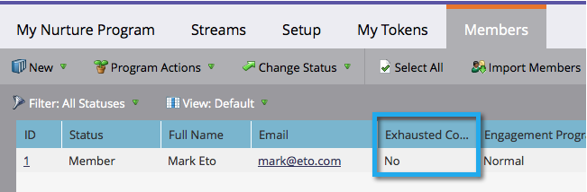

# Grundlegendes zu Interaktionsprogrammen {#understanding-engagement-programs}

Interaktionsprogramme sind so konzipiert, dass sie neue Personen ansprechen, indem sie ihnen Inhalte systematisch präsentieren.

>[!NOTE]
>
>Pro Abonnement sind maximal 100 **aktive** Interaktionsprogramme zulässig.

## Interaktionsprogramm {#engagement-program}

Ein **Interaktionsprogramm** ist ein Programmtyp, mit dem auf einfache Weise komplexes Nurturing durchgeführt werden kann.

>[!MORELIKETHIS]
>
>[Erstellen eines Interaktionsprogramms](/help/marketo/product-docs/email-marketing/drip-nurturing/creating-an-engagement-program/create-an-engagement-program.md)

## Stream {#stream}

Ein **Stream** ist ein Pool mit priorisierten Inhalten, die das Interaktionsprogramm verwendet, um Interaktionen mit Menschen zu pflegen.

>[!MORELIKETHIS]
>
>* [Hinzufügen eines Streams](/help/marketo/product-docs/email-marketing/drip-nurturing/creating-an-engagement-program/add-a-stream.md)
>* [Klonen eines Streams](/help/marketo/product-docs/email-marketing/drip-nurturing/engagement-program-streams/clone-a-stream.md)

## Inhalt {#content}

Es gibt zwei Typen von **Inhalt**, die Sie zu Interaktionsprogramm-Streams hinzufügen können: E-Mails und Programme. E-Mails werden zum Sendezeitpunkt an Personen gesendet.

>[!MORELIKETHIS]
>
>* [Hinzufügen von Inhalten zu einem Stream](/help/marketo/product-docs/email-marketing/drip-nurturing/creating-an-engagement-program/add-content-to-a-stream.md)
>* [Priorisieren von Stream-Inhalten](/help/marketo/product-docs/email-marketing/drip-nurturing/using-stream-content/prioritize-stream-content.md)
>* [Bearbeiten der Verfügbarkeit von Stream-Inhalten](/help/marketo/product-docs/email-marketing/drip-nurturing/using-stream-content/edit-availability-of-stream-content.md)
>* [Entfernen von Stream-Inhalten](/help/marketo/product-docs/email-marketing/drip-nurturing/using-stream-content/remove-stream-content.md)
>* [Archivieren und Aufheben der Archivierung von Stream-Inhalten](/help/marketo/product-docs/email-marketing/drip-nurturing/using-stream-content/archive-and-unarchive-stream-content.md)

## Umwandlung {#cast}

Eine **Umwandlung** ist das Ereignis des Versands von E-Mails über ein Interaktionsprogramm.

>[!NOTE]
>
>Interaktionsprogramme sind nicht für die Verwendung mit betrieblichen E-Mails konzipiert.

## Stream-Kadenz {#stream-cadence}

Sie entscheiden, wann eine Umwandlung geschieht, indem Sie eine **Stream-Kadenz** einrichten. Auf diese Weise planen Sie die Ausgabe von Inhalten in regelmäßigen Abständen.

>[!MORELIKETHIS]
>
>[Festlegen einer Stream-Kadenz](/help/marketo/product-docs/email-marketing/drip-nurturing/engagement-program-streams/set-stream-cadence.md)

## Personenkadenz {#person-cadence}

Eine **Personenkadenz** ist ein Status, mit dem die Fähigkeit definiert wird, Inhalte aus einem Interaktionsprogramm zu erhalten. Sie können den Flussschritt **[!UICONTROL Interaktionsprogramm-Kadenz ändern]** verwenden, um dies zu [!UICONTROL Pausiert] oder [!UICONTROL Normal] zu ändern.

## Erschöpft {#exhausted}

Sobald eine Person alle Inhalte in einem Stream erhalten hat, wird die Person als **Erschöpft** bezeichnet.

>[!MORELIKETHIS]
>
>[Personen mit erschöpften Inhalten](/help/marketo/product-docs/email-marketing/drip-nurturing/using-engagement-programs/people-who-have-exhausted-content.md)

## Grad der Inhaltsinteraktion {#content-engagement-level}

Der Grad der Inhaltsinteraktion ist eine Punktzahl von 0 bis 100, die Marketo Ihrem Inhalt zuweist. Diese Zahl wird mittels einer komplexen Formel bestimmt, die Öffnungsvorgänge, Klicks, Abbestellungen, Programmerfolg und andere Faktoren einbezieht.

>[!MORELIKETHIS]
>
>[Grundlegendes zur Interaktionsbewertung](/help/marketo/product-docs/email-marketing/drip-nurturing/reports-and-notifications/understanding-the-engagement-score.md)
