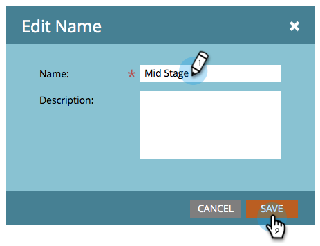

# Umbenennen eines Streams {#rename-a-stream}

Wenn Sie gerne organisiert bleiben, können Sie Ihre Streams umbenennen. Hier ist, wie man das macht.

1. Suchen Sie nach Ihrem Interaktions-Programm und wählen Sie es aus und klicken Sie dann auf **Streams**.

   

1. Klicken Sie mit der Dublette auf den aktuellen Stream-Namen.

   

1. Geben Sie den neuen Stream **Name** ein und klicken Sie auf **Speichern**.

   

   Und voila! Sie wissen jetzt, wie Streams umbenannt werden.

