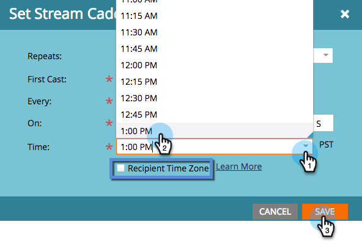

# Stream-Kadenz festlegen {#set-stream-cadence}

Sie können Interaktionsinhalte in jedem gewünschten Intervall senden. Zum Beispiel: einmal pro Woche oder jeden dritten Dienstag im Monat.

## Frequenz einstellen {#set-cadence}

1. Navigieren Sie **[!UICONTROL Marketing-Aktivitäten]**.

   

1. Suchen Sie Ihr Interaktionsprogramm, wählen Sie es aus, klicken Sie auf **[!UICONTROL Streams]** und dann auf **[!UICONTROL Stream-Kadenz festlegen]**.

   

1. Wählen Sie aus, wie oft die Kadenz wiederholt werden soll. Sie können zwischen **[!UICONTROL Wöchentlich]** oder **[!UICONTROL Monatlich]** wählen.

## Wöchentlich {#weekly}

1. Wählen Sie **[!UICONTROL Wöchentlich]** aus.

   

   >[!NOTE]
   >
   >Wenn Sie **[!UICONTROL Keine]** auswählen, wird der Stream abgeschaltet.

1. Wählen Sie das Datum der ersten Besetzung.

   

1. Wählen Sie jetzt aus, ob die Kadenz jede Woche oder in größeren Abständen erfolgen soll. Wählen wir alle 2 Wochen.

   

1. Entscheide, an welchen Wochentagen. In diesem Fall machen wir Dienstag, Mittwoch und Donnerstag.

   

   >[!TIP]
   >
   >Sie können die Kadenz so einstellen, dass sie jeden Tag ausgeführt wird, indem Sie **[!UICONTROL Wiederholungen]: [!UICONTROL Wöchentlich]** / **[!UICONTROL Alle]: 1 [!UICONTROL Woche]** / **[!UICONTROL Ein]**: alle Tage auswählen.

   Jetzt wähle die Zeit. Aktivieren Sie das Kontrollkästchen, wenn Sie [Zeitzone des Empfängers](/help/marketo/product-docs/email-marketing/drip-nurturing/engagement-program-streams/set-stream-cadence/schedule-engagement-programs-with-recipient-time-zone.md) verwenden möchten (d. h. Versand entsprechend den lokalen Zeitzonen), und klicken Sie dann auf **[!UICONTROL Speichern]**.

   

   >[!CAUTION]
   >
   >Der Inhalt wird an dem Datum ausgegeben, das Sie für die erste Besetzung ausgewählt haben. Stellen Sie daher sicher, dass er mit dem Wochentag übereinstimmt, den Sie auswählen. Andernfalls wird der Inhalt in der ersten Woche zweimal angezeigt.

1. Bewegen Sie den Mauszeiger über die Kadenz. Du wirst sehen, an welchen Tagen zukünftige Castings ausgehen werden.

   

   >[!NOTE]
   >
   >In diesem Beispiel wird am Donnerstag eine E-Mail gesendet. Wir überspringen dann eine Woche und senden am Dienstag, Mittwoch und Donnerstag der folgenden Woche erneut. Und dann wiederholen wir den Vorgang.

Das ist alles! Lesen Sie weiter, wenn Sie eine monatliche Kadenz einrichten möchten.

## Monatlich {#monthly}

1. Wählen Sie **[!UICONTROL Monatlich]** aus, wie oft sie sich wiederholt.

   

1. Wählen Sie das Datum der ersten Besetzung.

   

1. Wählen Sie aus, ob sie jeden Monat oder in größeren Abständen angezeigt werden soll… Lasst uns alle vier Monate auswählen.

   

1. Wählen Sie den Tag des angegebenen Monats aus, in diesem Fall den 22. jedes vierten Monats.

   

   >[!TIP]
   >
   >Alternativ können Sie den Wochentag auswählen.

1. Wählen Sie eine **[!UICONTROL Zeit]** und klicken Sie auf **[!UICONTROL Speichern]**.

   

1. Bewegen Sie den Mauszeiger über die Kadenz. Du wirst sehen, an welchen Tagen zukünftige Castings ausgehen werden.

   

   >[!CAUTION]
   >
   >Wenn Sie sich entscheiden, Ihre Interaktions-Stream-Kadenz später zu ändern, stellen Sie sicher, dass die erste Besetzung auf ein Datum in der Zukunft festgelegt ist.

Jetzt wissen Sie, wie Sie eine Stream-Kadenz einrichten!

>[!MORELIKETHIS]
>
>* [Informationen zur Zeitzone des Empfängers](/help/marketo/product-docs/email-marketing/email-programs/email-program-actions/scheduling-with-recipient-time-zone/understanding-recipient-time-zone.md)
>* [Planen von Interaktionsprogrammen mit der Zeitzone des Empfängers](/help/marketo/product-docs/email-marketing/drip-nurturing/engagement-program-streams/set-stream-cadence/schedule-engagement-programs-with-recipient-time-zone.md)
