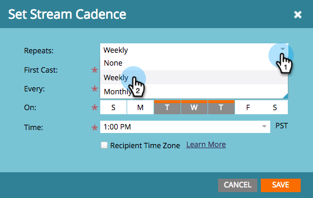
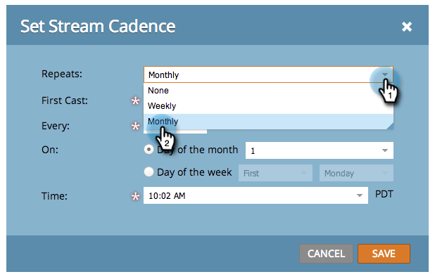

# Stream-Kadenz festlegen {#set-stream-cadence}

Sie können Interaktionsinhalte in jedem gewünschten Intervall senden. Beispiel: einmal pro Woche oder jeden dritten Dienstag des Monats.

## Frequenz einstellen {#set-cadence}

1. Navigieren Sie zu **Marketingaktivitäten**.

   

1. Wählen Sie Ihr Interaktionsprogramm aus und klicken Sie auf das **Streams** Registerkarte und klicken Sie dann auf **Stream-Kadenz festlegen**.

   

1. Wählen Sie aus, wie oft die Kadenz wiederholt werden soll. Sie können **Wöchentlich** oder **Monatlich**.

## Wöchentlich {#weekly}

1. Auswählen **Wöchentlich**.

   

   >[!NOTE]
   >
   >Auswählen **Keines** wird den Strom abschalten.

1. Wählen Sie das Datum der ersten Besetzung aus.

   

1. Entscheiden Sie jetzt, ob die Kadenz wöchentlich oder mit größeren Abständen stattfinden soll. Lasst uns alle zwei Wochen aussuchen.

   

1. Entscheiden Sie, an welchen Tagen der Woche. In diesem Fall machen wir Dienstag, Mittwoch und Donnerstag.

   

   >[!TIP]
   >
   >Sie können Ihre Cadence so einstellen, dass sie täglich ausgeführt wird, indem Sie **Wiederholt: Wöchentlich** / **Jeder: 1 Woche** / **on**: alle Tage.

   Wählen Sie jetzt die Zeit aus. Aktivieren Sie das Kontrollkästchen, wenn Sie [Zeitzone des Empfängers](/help/marketo/product-docs/email-marketing/drip-nurturing/engagement-program-streams/set-stream-cadence/schedule-engagement-programs-with-recipient-time-zone.md)(d. h. Bereitstellung entsprechend den lokalen Zeitzonen) und klicken Sie auf **Speichern**.

   

   >[!CAUTION]
   >
   >Der Inhalt wird an dem Datum ausgegeben, an dem Sie für die erste Wiedergabe ausgewählt haben. Stellen Sie daher sicher, dass er mit dem Wochentag übereinstimmt, den Sie auswählen. ansonsten wird es in der ersten Woche zweimal ausgehen.

1. Bewegen Sie den Mauszeiger über die Kadenz. Du wirst sehen, welche Tage zukünftige Kasten ausgehen werden.

   

   >[!NOTE]
   >
   >In diesem Beispiel wird am Donnerstag eine E-Mail gesendet. Dann überspringen wir eine Woche und schicken es am Dienstag, Mittwoch und Donnerstag der folgenden Woche erneut. Und dann schleichen wir uns wieder.

Das ist es! Lesen Sie weiter, wenn Sie einen monatlichen Cadence einrichten möchten.

## Monatlich {#monthly}

1. Auswählen **Monatlich** für wie oft es wiederholt.

   

1. Wählen Sie das Datum der ersten Besetzung aus.

   

1. Wählen Sie aus, ob der Abstand pro Monat oder größer sein soll... Lasst uns jeden vierten Monat aussuchen.

   

1. Wählen Sie den Tag des angegebenen Monats aus, in diesem Fall den 22. jedes vierten Monats.

   

   >[!TIP]
   >
   >Alternativ können Sie auch einen Wochentag wählen.

1. Auswählen einer **Zeit** und klicken Sie auf **Speichern**.

   

1. Bewegen Sie den Mauszeiger über die Kadenz. Du wirst sehen, welche Tage zukünftige Kasten ausgehen werden.

   

   >[!CAUTION]
   >
   >Wenn Sie sich dazu entscheiden, Ihren Interaktionsstrom-Kadenz später zu ändern, stellen Sie sicher, dass der erste Guss auf ein zukünftiges Datum eingestellt ist.

Jetzt wissen Sie, wie man eine Stream-Kadenz einrichtet!

>[!MORELIKETHIS]
>
>* [Verstehen der Zeitzone eines Empfängers](/help/marketo/product-docs/email-marketing/email-programs/email-program-actions/scheduling-with-recipient-time-zone/understanding-recipient-time-zone.md)
>* [Planen von Interaktionsprogrammen mit der Zeitzone der Empfänger](/help/marketo/product-docs/email-marketing/drip-nurturing/engagement-program-streams/set-stream-cadence/schedule-engagement-programs-with-recipient-time-zone.md)
