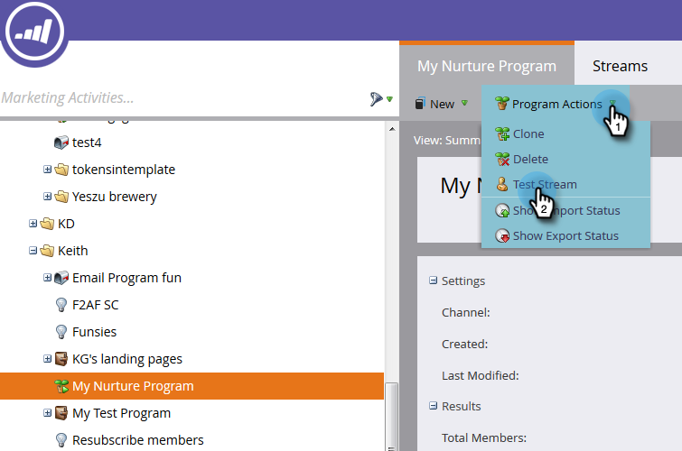

# Engagement-Strom testen {#test-an-engagement-stream}

Nachdem Sie Ihren gesamten Inhalt einem Stream hinzugefügt haben, können Sie ihn einzeln testen.

1. Wechseln Sie zu **Marketingaktivitäten**.

   

1. Wählen Sie Ihr Interaktionsprogramm aus.

   

1. Klicken Sie auf **Programmaktionen** und wählen Sie **Teststream** aus.

   

1. Wählen Sie Ihre Person aus der Dropdownliste **Testperson** aus. Denken Sie daran, dass der Inhalt tatsächlich ausgeht. Beachten Sie das bei der Auswahl.

   

   >[!CAUTION]
   >
   >Stellen Sie sicher, dass Ihre Testperson eindeutig ist und keine Duplikate in der Datenbank enthält.

   >[!TIP]
   >
   >Wenn die gesuchte Testperson nicht vorhanden ist, verwenden Sie die Option **Person erstellen** , um eine Person spontan zu erstellen.

   Klicken Sie auf &quot;Ursprünglicher Stream&quot;, wählen Sie den zu testenden Stream aus und klicken Sie auf &quot;Test ausführen&quot;.
   

1. Nachdem die Person die zuvor eingerichteten [Übergangsregeln](/help/marketo/product-docs/email-marketing/drip-nurturing/engagement-program-streams/transition-people-between-engagement-streams.md) durchlaufen hat, klicken Sie auf das Symbol Aktualisieren .

   

1. Der neue Stream wird angezeigt, was auf einen erfolgreichen Test hinweist.

   

   Gute Arbeit!

   >[!NOTE]
   >
   >Es werden keine anderen Inhalte gesendet, es sei denn, Sie klicken auf **Cast nochmal ausführen**.
