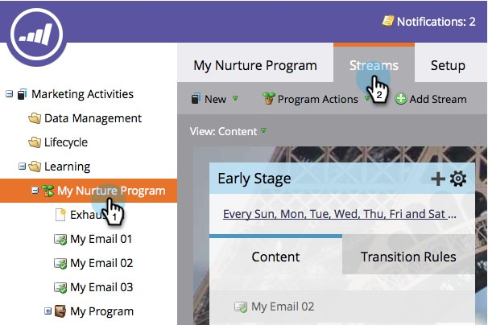

# Personen zwischen Interaktionsströmen wechseln {#transition-people-between-engagement-streams}

Interaktionsprogramme können mehr als einen Stream haben. Wenn Sie [einen Stream hinzufügen](/help/marketo/product-docs/email-marketing/drip-nurturing/creating-an-engagement-program/add-a-stream.md), sollten Sie eine Möglichkeit definieren, wie Personen von einem Stream zum anderen wechseln können. Diese werden **Übergangsregeln“**

1. Navigieren Sie **Marketing-Aktivitäten**.

   

1. Wählen Sie Ihr Multi-Streaming-Interaktionsprogramm aus und navigieren Sie zu **Streams**.

   

1. Klicken Sie **Übergangsregeln** für den Stream, den Sie aus anderen Streams abrufen möchten, und klicken Sie dann auf **Übergangsregeln bearbeiten**.

   

   >[!NOTE]
   >
   >Übergangsregeln rufen einen Stream ab. Definieren Sie immer die Regeln für den Stream, in den Sie wechseln möchten.

   Sobald sich das Fenster für die Übergangsregel öffnet, suchen Sie den gewünschten Trigger und ziehen Sie ihn in den entsprechenden Bereich. In diesem Fall möchten wir Personen in die mittlere Phase versetzen, wenn dies zu einer Opportunity hinzugefügt wird.

   

1. Stellen wir den Operator auf &quot;**&quot; ein** damit die Benutzer für jede zusätzliche Möglichkeit zu ihm wechseln.

   

   >[!TIP]
   >
   >Sie können einer Übergangsregel mehrere Trigger und Filter hinzufügen, aber die Übergangsregel verwendet alle Filter (die einzige Option ist die Verwendung aller Filter). Wenn Sie ODER in einer Übergangsregel verwenden müssen, empfehlen wir, stattdessen eine externe intelligente Kampagne einzurichten.

1. Klicken Sie auf **Schließen**.

   

   Sehr gut! Jetzt wird jede Person in Ihrem Interaktionsprogramm, die zu einer Opportunity hinzugefügt wird, in den Mid-Stage-Stream verschoben.

   

   >[!NOTE]
   >
   >Die oben beschriebenen Schritte *tun* gelten auch für Personen[ die ](/help/marketo/product-docs/email-marketing/drip-nurturing/using-engagement-programs/pause-people-in-an-engagement-program.md) anhalten.
