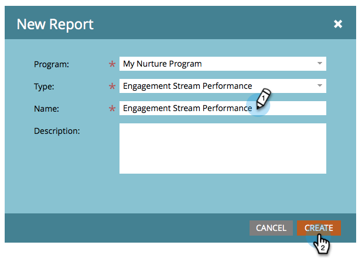

# Leistungsbericht für Interaktionsströme {#engagement-stream-performance-report}

Möchten Sie wissen, wie Ihre Interaktionsinhalte funktionieren? Testen Sie den Bericht zur Interaktions-Stream-Leistung.

## Erstellen des Berichts {#create-the-report}

1. Suchen Sie Ihr Interaktionsprogramm, wählen Sie es aus und klicken Sie dann unter **[!UICONTROL Neu]** auf **[!UICONTROL Neues lokales Asset]**.

   

1. Wählen Sie **[!UICONTROL Bericht]** aus.

   

   >[!TIP]
   >
   >Durch die Erstellung des Berichts im Rahmen des Programms wird dieser automatisch auf den Inhalt des Programms beschränkt.

   Wählen Sie **[!UICONTROL Interaktions-Stream]** als Bericht **[!UICONTROL Typ]**.
   

1. Benennen Sie Ihren Bericht und klicken Sie auf **[!UICONTROL Erstellen]**.

   

   Konfigurieren Sie nun die Einstellungen.

## Einstellungen bearbeiten {#edit-settings}

1. Suchen Sie Ihren Bericht und wählen Sie ihn aus.

   

1. Doppelklicken Sie auf **[!UICONTROL Registerkarte]** auf den Filter **[!UICONTROL Interaktionsprogramm-E-Mails]**.

   

1. Wählen Sie die E-Mail(s) aus, zu der Sie einen Bericht erstellen möchten, und klicken Sie auf **[!UICONTROL Anwenden]**.

   

## Bericht ausführen {#run-report}

1. Um den Bericht auszuführen, klicken Sie auf die Registerkarte **[!UICONTROL Bericht]**.

   

   >[!TIP]
   >
   >Obwohl nicht dargestellt, ist der Interaktionswert eine Spalte in diesem Bericht. Unter [Verstehen des Interaktionswerts](/help/marketo/product-docs/email-marketing/drip-nurturing/reports-and-notifications/understanding-the-engagement-score.md) finden Sie Details dazu, was er ist.

   Beachten Sie, dass der Bericht nach Interaktionsprogramm gruppiert ist.
