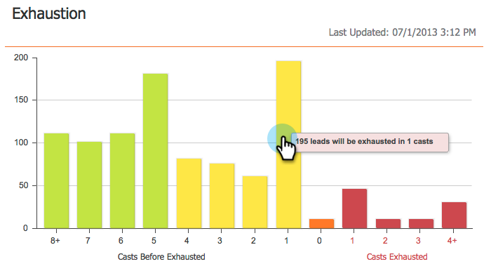
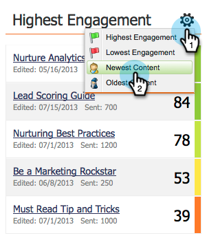

# Das Interaktions-Dashboard {#the-engagement-dashboard}

Das Interaktions-Dashboard ist die einfachste Möglichkeit, um zu sehen, wie die Inhalte in Ihrem Interaktionsprogramm funktionieren.

>[!NOTE]
>
>Der Interaktionswert enthält Daten aus Ihren letzten drei Prüfungen. Eine neue wird 72 Stunden nach jedem Cast berechnet. Weitere Informationen zum [Interaktionswert](/help/marketo/product-docs/email-marketing/drip-nurturing/reports-and-notifications/understanding-the-engagement-score.md).

## Interaktions-Dashboard anzeigen {#view-the-engagement-dashboard}

Wählen Sie Ihr Interaktionsprogramm aus und klicken Sie auf **Anzeigen** > **[!UICONTROL Dashboard]**.

>[!TIP]
>
>Ausführlichere Statistiken finden Sie im [Bericht zur ](/help/marketo/product-docs/email-marketing/drip-nurturing/reports-and-notifications/engagement-stream-performance-report.md) des Interaktionsstroms“.

## Erläuterung des Erschöpfungs-Widgets {#understand-the-exhaustion-widget}

Dieses Widget hilft Ihnen dabei, vorauszusehen, wann die Leads alle Inhalte erschöpft haben werden. Die Erschöpfungsbewertung wird unmittelbar nach jedem Gips berechnet. Das folgende Beispiel zeigt, dass in einer Besetzung 195 Leads alle Inhalte erschöpft haben.

>[!NOTE]
>
>Sie müssen auf der Registerkarte [!UICONTROL Setup] sicherstellen, dass [!UICONTROL Erschöpfte Inhaltsbenachrichtigungen] aktiviert **[!UICONTROL ,]** das obige Diagramm anzuzeigen. Wenn sie deaktiviert sind, sieht das Diagramm anders aus.

>[!CAUTION]
>
>Personen, die „erschöpft“ sind, erhalten in der nächsten Besetzung keine Nachricht.

## Grundlegendes zum Widget „Interaktion im Zeitverlauf“ {#understand-the-engagement-over-time-widget}

Zeigt die durchschnittliche Interaktionsbewertung im Zeitverlauf und die Auswirkungen von Inhaltsbearbeitungen an.

>[!AVAILABILITY]
>
>Diese Funktion ist als Add-on für Kunden verfügbar, die den Umsatzzyklus-Explorer von Marketo verwenden. Weitere Informationen erhalten Sie vom Adobe Account Team (Ihrem Account Manager).

Um ein einzelnes Inhaltselement anstelle eines Durchschnitts anzuzeigen, klicken Sie auf das Zahnradsymbol und wählen Sie dann das Inhaltselement aus.

## Das Widget „Höchste Interaktion“ {#understand-the-highest-engagement-widget}

Eine Liste aller Inhalte, sortiert nach der höchsten Interaktionsbewertung.

Klicken Sie zum Ändern der Sortierung auf das Zahnradsymbol und wählen Sie dann die Sortierreihenfolge aus.

_Neueste_ und _Älteste_ basieren auf dem Zeitpunkt der letzten Genehmigung.

>[!NOTE]
>
>Weitere Informationen finden Sie in der [Erstellen eines Interaktionsprogramms](/help/marketo/product-docs/email-marketing/drip-nurturing/creating-an-engagement-program/create-an-engagement-program.md) Vertiefung.
