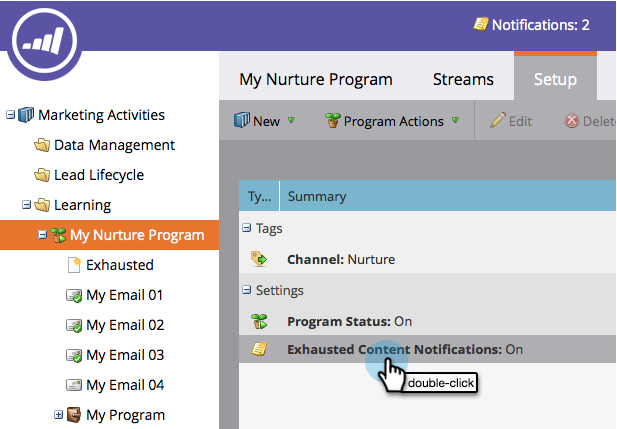

# Deaktivieren und Aktivieren von Benachrichtigungen übe erschöpfte Inhalte {#disable-and-enable-exhausted-content-notifications}

Wenn Personen alle Inhalte in einem Stream ausfüllen, kann Marketo Ihnen eine Benachrichtigung senden. Sie können die Benachrichtigungen entsprechend Ihren Anforderungen deaktivieren/aktivieren.

1. Navigieren Sie zu **[!UICONTROL Marketing-Aktivitäten]**.

   

1. Wählen Sie ein Interaktionsprogramm aus und klicken Sie auf die Registerkarte **[!UICONTROL Setup]**.

   

1. Doppelklicken Sie auf **[!UICONTROL Benachrichtigungen über erschöpften Inhalt]**.

   

1. Wählen Sie **[!UICONTROL Aus]** (oder **[!UICONTROL Ein]**) und klicken Sie auf **[!UICONTROL Speichern]**.

   

   Wenn Sie Benachrichtigungen aktivieren, werden Sie etwas im Stream selbst sehen und eine E-Mail-Benachrichtigung erhalten.
